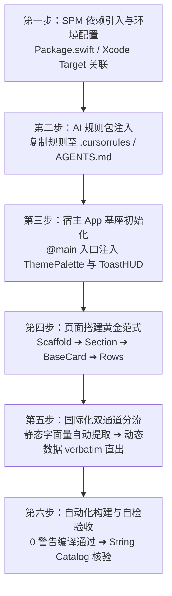

# AI 接入与协同规范指南 (AI Integration & Implementation Guide)

本文档专为 **AI 编程助手**（如 Antigravity、Claude Code、Cursor、Windsurf、GitHub Copilot 等）以及负责指导 AI 的 iOS 研发人员设计。
当你在一个新项目或现有业务工程中接入并使用 `AuraDesignSystem`（`swiftui-components`）时，**必须严格遵循本文档所定义的流程与设计系统红线**。

---

## 🧭 接入全景工作流 (Workflow Overview)



---

## 第一步：SPM 依赖引入与环境基线

### 1. 平台与工具链基线要求
- **部署目标**：iOS 18.0+ / macOS 14.0+
- **工具链**：Xcode 16.0+ / Swift 6.0+（兼容 Swift 5.10 严格并发模式）

### 2. 添加依赖方式

#### 方式 A：通过 `Package.swift`（推荐 SPM 工程）
在宿主工程的 `Package.swift` 中引入：

```swift
// swift-tools-version: 6.0
import PackageDescription

let package = Package(
    name: "MyConsumerApp",
    platforms: [.iOS(.v18), .macOS(.v14)],
    dependencies: [
        .package(url: "https://github.com/18113996630/swiftui-components.git", branch: "main")
    ],
    targets: [
        .target(
            name: "MyConsumerApp",
            dependencies: [
                .product(name: "AuraDesignSystem", package: "swiftui-components")
            ]
        )
    ]
)
```

#### 方式 B：通过 Xcode 图形界面
1. 打开宿主 Xcode 工程，选择菜单 **File > Add Package Dependencies...**；
2. 输入仓库 Git 链接：`https://github.com/18113996630/swiftui-components.git`；
3. Dependency Rule 选择 **Branch: main**（或指定最新 Tag/Commit）；
4. 在 **Add to Target** 勾选你的业务 Target，库产品选择 `AuraDesignSystem`。

#### 方式 C：本地 Monorepo / 本地开发引用
若组件库在本地同级目录下开发调试：
```swift
.package(path: "../swiftui-components")
```

---

## 第二步：向宿主项目的 AI 注入规则包 (Prompt Injection)

> 💡 **核心建议**：AI 默认没有外部组件库的记忆，极易幻觉造轮子或使用原生生硬排版。在业务宿主工程中，请将以下规则内容保存为 `.cursorrules`、`AGENTS.md` 或直接粘贴给 AI。

### 📋 可直接复制的下游 AI 提示词模板 (System Prompt / Agent Rules)

```markdown
# 业务工程 UI 开发规范：AuraDesignSystem 消费法则

你正在使用 `AuraDesignSystem` 组件库为本应用构建高质感、原生细腻的 SwiftUI 界面。作为业务调用方，你只需消费组件库提供的标准组件与设计规范，无需重复实现基础组件：

## 1. 核心消费铁律
- 【严禁自造轮子】：页面、卡片、设置行、输入框、按钮、分段选择器、徽标、弹窗等元素必须优先使用 `AuraDesignSystem` 已提供的标准组件，严禁手写粗糙的原生平替。
- 【排版与对比度】：核心标题一律用 `DesignSystem.Color.textPrimary`；次级文字一律用 `DesignSystem.Color.textSecondary`，严禁二次叠加 `.opacity(...)` 造成文字发灰发虚。
- 【连续超椭圆】：所有圆角统一使用 `DesignSystem.CornerRadius` 并附带 `.continuous` 连续曲率样式。
- 【多巴胺主题联动】：高光与强调色使用 `@Environment(\.themePalette)`，严禁硬编码固定颜色（如 `.foregroundColor(.blue)`）。
- 【微交互手感】：所有可交互按钮必须附带 `.buttonStyle(ScaleButtonStyle())`，触感统一调用 `HapticManager.shared.impact(...)`。
- 【业务文案传参分流】：
  - 界面静态文案（如标题、说明、按钮文案）：直接传未具名字符串字面量（Xcode String Catalog 会自动抓取）；
  - 运行时动态数据（如用户名、API 返回文本）：必须使用 `verbatim: String` 初始化器传参，防编译报错与误索引。

## 2. 页面搭建三层黄金架构
任何业务或表单页面必须按照以下骨架标准组装：
AuraScaffold (全屏外框，自动提供 16pt 外边距与 24pt 段落流)
  └── AuraSection (段落标头，集成 SF 图标底座与状态徽标)
        └── BaseCard (纯白浮岛高质感卡片容器)
              └── 行组件 (SettingsRow / ChecklistRow / TimelineTaskRow / ClearableTextFieldRow 等)
```

---

## 第三步：宿主 App 基座初始化与全局配置

在宿主应用的 `@main` 入口或顶级根视图处，配置多巴胺调色盘环境与全局挂载点：

```swift
import SwiftUI
import AuraDesignSystem

@main
struct ConsumerApp: App {
    // 1. 全局主题状态（支持 9 种活力主题色：.indigo, .coral, .amber, .emerald, .teal, .sky, .violet, .rose, .slate）
    @State private var currentTheme: ThemePalette = .indigo

    // 2. 全局轻提示状态
    @State private var toastMessage: LocalizedStringKey? = nil
    @State private var toastIcon: String? = nil

    var body: some Scene {
        WindowGroup {
            ContentView()
                // 3. 动态主题穿透整个应用视图层级
                .themePalette(currentTheme)
                // 4. 顶层挂载毛玻璃 ToastHUD 提示
                .toastHUD(message: toastMessage, icon: toastIcon)
        }
    }
}
```

---

## 第四步：组件能力速查字典（避免 AI 重复造轮子）

AI 在实现功能前，必须先查阅此表，匹配对应官方组件：

| 类别 | 官方组件名 | 核心职责与场景 | 最小调用示例 |
|---|---|---|---|
| **页面基座** | `AuraScaffold` | 页面级滚动骨架，自动配平 16pt 外边距与 24pt 段落节奏 | `AuraScaffold { ... }` |
| **段落分组** | `AuraSection` | HIG 规范段落，自带 SF 图标基座与状态徽标 | `AuraSection("基本设置", icon: "gearshape") { ... }` |
| **段落标头** | `HIGSectionHeaderView` | 单独使用的分组头部视图 | `HIGSectionHeaderView("高级选项", icon: "slider.horizontal.3")` |
| **浮岛容器** | `BaseCard` | 纯白卡片仓（20pt/28pt 连续曲率超椭圆，微漫反射阴影） | `BaseCard { ... }` |
| **设置与导航** | `SettingsRow` | 设置项、导航项、开关行，带彩色图标底座与 badge | `SettingsRow(icon: "bell.fill", iconColor: .orange, title: "通知", subtitle: "开启声音提醒")` |
| **输入行** | `ClearableTextFieldRow` | 沉浸式卡片输入框，带一键清空与快速剪贴板粘贴 | `ClearableTextFieldRow(title: "昵称", text: $name, placeholder: "请输入")` |
| **行内操作** | `FormRowActionButton` | 表单行底部的居中主功能或危险操作按键 | `FormRowActionButton(title: "退出登录", role: .destructive) { ... }` |
| **展示微标** | `PillBadge` | 语义微标（`.subtle` 柔光底、`.solid` 饱满、`.neutral` 灰度） | `PillBadge("PRO", style: .subtle, tintColor: .purple)` |
| **交互标签** | `PillButton` | 紧凑型胶囊按键，内置缩放微动效 | `PillButton("立即升级", icon: "sparkles") { ... }` |
| **多选/单选** | `SelectableChip` | 胶囊芯片，选中时带弹性 Checkmark 展开动效 | `SelectableChip(title: "科技", isSelected: $selected)` |
| **可删标签** | `DeletableChip` | 话题与关键词标签，带一键移除按键 | `DeletableChip(title: "SwiftUI") { ... }` |
| **分段选择** | `PillSegmentedPicker` | 软底滑块分段器，支持泛型与动态映射 | `PillSegmentedPicker(selection: $tab, items: [0, 1]) { ... }` |
| **下划导航** | `UnderlinedTabBar` | 极简纯文字下划线 Tab 栏 | `UnderlinedTabBar(selection: $tab, items: ["最新", "热门"]) { ... }` |
| **数值滑杆** | `PrecisionSliderRow` | 等宽数字徽标实时滑杆，阻尼感良好 | `PrecisionSliderRow(title: "音量", value: $volume, range: 0...100)` |
| **图标徽标** | `IconBadge` | 彩色超椭圆底座 + 白色 SF Symbol | `IconBadge(systemName: "star.fill", color: .yellow)` |
| **图标拾取** | `SFSymbolGridPicker` | 原生 SF Symbols 图标网格选择器 | `SFSymbolGridPicker(selection: $icon)` |
| **主题调色** | `PaletteColorPicker` | 9 种多巴胺主题色彩拾取面板 | `PaletteColorPicker(selection: $theme)` |
| **空状态** | `EmptyStateView` | 标杆级空状态占位，支持图标、标题、副标题与主按键 | `EmptyStateView(icon: "tray", title: "暂无数据", subtitle: "下拉刷新试试")` |
| **通栏通知** | `NoticeBanner` | 嵌入式信息/警告/错误通知条 | `NoticeBanner(style: .info, "数据已同步最新")` |
| **打字机卡片** | `TypewriterStreamingCard` | AI 文本流式打印卡片，带纯图标呼吸状态与停止键 | `TypewriterStreamingCard(text: streamText, isStreaming: true)` |
| **时间线行** | `TimelineTaskRow` | 38pt 饱满节点时间线项与空闲时段连接线 | `TimelineTaskRow(time: "10:00", title: "会议", isCompleted: $done)` |
| **待办清单** | `ChecklistRow` | 待办复选框列表行，带完成划线与渐隐动效 | `ChecklistRow(title: "完成文档编写", isCompleted: $done)` |
| **模态表单** | `HeroBannerSheet` | 顶部沉浸式色彩渐变卡片模态弹窗 | `HeroBannerSheet(title: "升级提示", icon: "crown.fill") { ... }` |
| **悬浮轻提示** | `ToastHUD` / 修饰符 | 居中毛玻璃微提示气泡 | `.toastHUD(message: "已保存", icon: "checkmark")` |
| **流式布局** | `FlowLayout` | 自动折行标签云布局协议 | `FlowLayout(spacing: 8) { ForEach(...) { ... } }` |

---

## 第五步：标准页面搭建代码示例

以下是 AI 在宿主工程中快速组装一个完整功能模块的标准代码模版：

```swift
import SwiftUI
import AuraDesignSystem

struct ProfileSettingsView: View {
    @State private var username = "Alex"
    @State private var pushEnabled = true
    @State private var experienceLevel = 1
    @State private var selectedTheme: ThemePalette = .indigo

    var body: some View {
        AuraScaffold {
            // 1. 分段选择控制
            PillSegmentedPicker(
                selection: $experienceLevel,
                items: [0, 1, 2],
                titleForIndex: { ["初级", "中级", "高级"][$0] }
            )

            // 2. 核心段落：个人信息
            AuraSection("基本信息", icon: "person.crop.circle.fill", badgeText: "必填") {
                BaseCard {
                    ClearableTextFieldRow(
                        title: "用户昵称",
                        text: $username,
                        placeholder: "请输入你的称呼"
                    )

                    SettingsRow(
                        icon: "paintpalette.fill",
                        iconColor: .purple,
                        title: "主题换肤",
                        subtitle: "选择个人偏好的多巴胺主色调"
                    ) {
                        PaletteColorPicker(selection: $selectedTheme)
                    }
                }
            }

            // 3. 次级段落：通知与系统
            AuraSection("系统与偏好", icon: "gearshape.2.fill") {
                BaseCard {
                    SettingsRow(
                        icon: "bell.badge.fill",
                        iconColor: .orange,
                        title: "推送通知",
                        subtitle: "每日早间推送待办提醒",
                        isOn: $pushEnabled
                    )

                    SettingsRow(
                        icon: "shield.lefthalf.filled",
                        iconColor: .green,
                        title: "隐私政策",
                        badgeText: "V2.0"
                    ) {
                        Image(systemName: "chevron.right")
                            .font(.system(size: 13, weight: .semibold, design: .rounded))
                            .foregroundColor(DesignSystem.Color.textTertiary)
                    }
                }
            }

            // 4. 底部危险/操作动作
            FormRowActionButton(title: "清空缓存与退出", role: .destructive) {
                HapticManager.shared.notification(.warning)
                // 业务退出逻辑...
            }
        }
        .themePalette(selectedTheme) // 动态响应主题换肤
    }
}
```

---

## 第六步：国际化双通道处理策略 (i18n Best Practices)

为确保组件库在支持 **Xcode 15+ String Catalog (`.xcstrings`) 自动化静态提取** 的同时，不给动态数据带来阻碍，AI 必须严格执行以下规则：

### 1. 静态可翻译文案（采用 String Literal）
直接传递字符串字面量给组件。编译时，Xcode 的 AST 扫描器会自动将这些文案抓取至宿主工程的 `Localizable.xcstrings` 中：

```swift
// ✅ 正确：直接传递字面量，自动入库 xcstrings
AuraSection("Account Settings", icon: "person.fill") {
    SettingsRow(
        icon: "lock.fill",
        iconColor: .blue,
        title: "Two-Factor Auth",
        subtitle: "Protect your account with SMS or Authenticator",
        badgeText: "Recommended"
    )
}
```

### 2. 运行时动态数据（采用 `verbatim:` 参数）
对于来自服务器接口、用户输入或非本地化的动态变量，**必须**调用组件提供的 `verbatim:` 初始化器：

```swift
let dynamicUserName: String = apiUser.nickname
let dynamicEmail: String = apiUser.email

// ✅ 正确：使用 verbatim 避免编译错误，且不污染 String Catalog
AuraSection(verbatim: dynamicUserName, icon: "person.text.rectangle") {
    SettingsRow(
        verbatim: dynamicUserName,
        subtitle: dynamicEmail
    )
}
```

### 3. 零内置文案的消费优势（无需处理状态文字本地化）
`AuraDesignSystem` 内部已全面实现**零硬编码文案与状态图标化闭环**（例如：`TypewriterStreamingCard` 的流式生成状态内置为纯视觉呼吸动效指示灯，键盘辅助栏收起按钮默认为原生 SF 图标）：
- **业务消费方完全无需操心组件内部状态词的翻译与多语言配置**；
- 若业务层有特定的徽标（如 `"PRO"`、`"NEW"`）或特定提示词，只需通过对应参数显式传入即可，组件库不会强行捆绑任何预置文案。

---

## 第七步：AI 常见翻车陷阱与防御守则 (Anti-patterns & Fixes)

| 典型翻车场景 | ❌ AI 错误写法（严禁） | ✅ 标准正确写法 | 根因与设计系统考量 |
|---|---|---|---|
| **自造圆角卡片** | `VStack { ... }.background(Color.white).cornerRadius(10)` | `BaseCard { ... }` | 破坏 20pt 超椭圆（`.continuous`）与全局漫反射阴影规范。 |
| **次级文字发灰** | `Text("副标题").foregroundColor(.gray).opacity(0.6)` | `Text("副标题").foregroundColor(DesignSystem.Color.textSecondary)` | 二次叠加透明度会导致对比度严重低于 WCAG 4.5:1，造成视觉疲劳。 |
| **生硬原生滚动** | `ScrollView { VStack(spacing: 20) { ... } }` | `AuraScaffold { ... }` | 丢失 16pt 外边距与 24pt 段落流节奏控制。 |
| **硬编码主题色** | `.foregroundColor(.blue)` 或 `.tint(.blue)` | `@Environment(\.themePalette) var theme` 并使用 `theme.primary` | 无法穿透动态 9 色多巴胺换肤系统。 |
| **按键缺失触感** | 普通 `Button(...) { ... }` | `Button(...) { ... }.buttonStyle(ScaleButtonStyle())` | 缺少 0.97 弹性微缩手感与物理反馈。 |
| **动态变量错传** | `SettingsRow(title: user.dynamicName)`（若定义为 LocalizedStringKey 会报编译错误） | `SettingsRow(verbatim: user.dynamicName)` | `String` 变量无法隐式转换为 `LocalizedStringKey`，必须走 `verbatim:` 通道。 |
| **重复实现空状态** | 手写 `Image(...)` + `Text(...)` + `Button(...)` 堆叠居中 | `EmptyStateView(icon: "...", title: "...", subtitle: "...")` | 官方组件已经精调好 64pt 图标底座与最佳纵向间距。 |

---

## 第八步：自动化构建与验收自检清单 (Verification Checklist)

当 AI 完成页面编写或重构后，必须执行以下自检流程：

- [ ] **编译验证**：在终端运行 `swift build` 或在 Xcode 执行编译，确保处于 **0 错误、0 警告** 状态。
- [ ] **String Catalog 验证**：若宿主工程有 `Localizable.xcstrings`，检查新增的静态文案是否已被 Xcode 正确索引，且没有误录入动态数据。
- [ ] **设计红线核验**：
  - 页面结构是否使用 `AuraScaffold` + `AuraSection` + `BaseCard`？
  - 是否有遗漏的 `Color.gray.opacity(...)` 或原生 `.cornerRadius(...)`？
  - 所有按钮是否应用了 `ScaleButtonStyle`？
- [ ] **换肤测试**：切换 `.themePalette(.coral)` 或 `.themePalette(.emerald)`，确认整个页面的高光色与徽标均能平滑联动。
