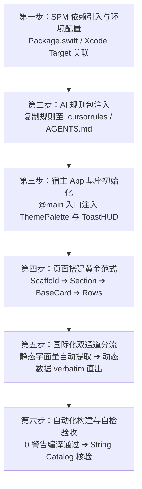

# AI 接入与协同规范指南 (Apple Recommended App & ADA Caliber Integration Guide)

本文档专为 **AI 编程助手**（如 Antigravity、Claude Code、Cursor、Windsurf、GitHub Copilot 等）以及负责指导 AI 的 iOS 研发人员设计。
核心使命：**指导业务侧 AI 助手严格以 Apple Design Award (ADA) 获奖作品与 Apple 官方推荐应用（Apple Recommended Apps）的严苛人机工程与视觉标准，构建具备克制美学、呼吸感、物理触感与零瑕疵排版的生产级 SwiftUI 页面。**
当你在一个新项目或现有业务工程中接入并使用 `AuraDesignSystem`（`swiftui-components`）时，**必须严格遵循本文档所定义的流程与设计系统红线**。

---

## 🧭 接入全景工作流 (Workflow Overview)



---

## 第一步：SPM 依赖引入与环境基线

### 1. 平台与工具链基线要求
- **部署目标**：iOS 18.0+ / macOS 14.0+
- **工具链**：Xcode 16.0+ / Swift 6.0+（兼容 Swift 5.10 严格并发模式）

### 2. 添加依赖方式

#### 方式 A：通过 `Package.swift`（推荐 SPM 工程）
在宿主工程的 `Package.swift` 中引入：

```swift
// swift-tools-version: 6.0
import PackageDescription

let package = Package(
    name: "MyConsumerApp",
    platforms: [.iOS(.v18), .macOS(.v14)],
    dependencies: [
        .package(url: "https://github.com/18113996630/swiftui-components.git", branch: "main")
    ],
    targets: [
        .target(
            name: "MyConsumerApp",
            dependencies: [
                .product(name: "AuraDesignSystem", package: "swiftui-components")
            ]
        )
    ]
)
```

#### 方式 B：通过 Xcode 图形界面
1. 打开宿主 Xcode 工程，选择菜单 **File > Add Package Dependencies...**；
2. 输入仓库 Git 链接：`https://github.com/18113996630/swiftui-components.git`；
3. Dependency Rule 选择 **Branch: main**（或指定最新 Tag/Commit）；
4. 在 **Add to Target** 勾选你的业务 Target，库产品选择 `AuraDesignSystem`。

#### 方式 C：本地 Monorepo / 本地开发引用
若组件库在本地同级目录下开发调试：
```swift
.package(path: "../swiftui-components")
```

---

## 第二步：向宿主项目的 AI 注入规则包 (Prompt Injection)

> 💡 **核心建议**：AI 默认没有外部组件库的记忆，极易幻觉造轮子或使用原生生硬排版。在业务宿主工程中，请将以下规则内容保存为 `.cursorrules`、`AGENTS.md` 或直接粘贴给 AI。

### 📋 方案 1：专供下游业务工程的极简动态指针模板 (Zero-Maintenance Prompt)

> 💡 **最佳实践**：在下游业务工程中，**严禁硬编码组件清单或静态 API 说明**。只需将以下 10 余行精炼规则写入业务工程的 `.cursorrules`、`AGENTS.md` 或直接投喂给 AI 即可：

```markdown
# 业务工程 UI 开发规范：AuraDesignSystem 消费法则

本工程接入了 `AuraDesignSystem` 统一微光设计系统。为避免规则过时与版本错配，你必须严格遵循 Apple Design Award (ADA) 获奖作品与 Apple 官方推荐应用的人机交互标准，执行以下动态自省流程：

## 1. 动态查阅最新规范（单一真实源）
在编写、重构或设计任何 UI 界面之前，你必须优先读取本地 SPM 已检出的组件库权威文档：
- 本地路径 1（SPM CLI 工程）：`.build/checkouts/swiftui-components/docs/INTEGRATION_GUIDE.md`
- 本地路径 2（Xcode 现代工程）：`SourcePackages/checkouts/swiftui-components/docs/INTEGRATION_GUIDE.md`
- 若找不到上述路径，请使用文件查找工具检索 `INTEGRATION_GUIDE.md`，或在线查阅：
  `https://raw.githubusercontent.com/18113996630/swiftui-components/main/docs/INTEGRATION_GUIDE.md`
**查阅文档中的「组件速查表」匹配现有官方组件，严禁自造轮子。**

## 2. 全场景三层黄金架构（适用于所有页面类型）
所有页面必须严格按照组件库三层架构构建，禁止随意散落原生 `ScrollView + VStack` 拼凑界面：
AuraScaffold (全屏外框，自动锁死 16pt 外边距与 24pt 段落流，打底 systemGroupedBackground)
  └── AuraSection (段落标头；若卡片内已有彩色图标，Header 必须保持纯文字大标)
        └── BaseCard (纯白浮岛高质感卡片仓；若子组件已内置 padding 则显式声明 padding: 0)
              └── 业务核心组件 (SettingsRow / ChecklistRow / TimelineTaskRow / FlowLayout / ClearableTextFieldRow 等)

## 3. 🏆 Apple Design Award (ADA) 级九大顶流人机交互铁律（严禁触碰）
无论你在构建表单、看板、时间线、标签池、详情页还是模态弹窗，必须严格遵循 Apple 官方推荐标杆标准：

1. 【原生导航通透感与零浮动药丸 (Native Chrome / Zero Floating Pills)】：
   - 模态 Sheet 关闭/完成按钮一律采用原生 `ToolbarItem(placement: .confirmationAction) { Button("完成") { ... } }` 与 `.cancellationAction`。
   - ❌ 绝对禁止在右上角自造白底带阴影的“浮动白色药丸”实体按键，杜绝浓厚的 Web/安卓拼凑异物感。
   - 模态页强制使用 `.navigationBarTitleDisplayMode(.inline)`，一级主视图采用 `.large` 大标并响应滚动收起。
2. 【全域 58pt 严格物理对齐基线 (Rigid 58pt Anchor)】：
   - 当列表行包含 24pt 图标底座时，卡片内所有分割线必须统一锁死 `.padding(.leading, 58).opacity(0.35)`！
   - ❌ 绝对禁止同一卡片内“一行有图标、一行无图标”导致首字锯齿凹凸；绝对禁止卡片 A 是 58pt、卡片 B 变成 20pt。
3. 【高级多巴胺语义分区与防荧光色 (Harmonious Color Chunking & Anti-Neon)】：
   - 严格遵循 80% 黑白灰骨架 + 20% 多巴胺提亮，杜绝彩虹杂色与刺眼高饱和霓虹色（如 `#FF00FF`、`#00FF00`）。
   - 遵循功能分类色相：基础设施(Indigo)、智慧人设(温润 Berry 浆果紫)、工具智库(Teal/Amber)、系统数据(Sky)。
   - ❌ 绝对禁止全屏纯蓝同质化（导致用户无法通过色彩建立视觉分区记忆）。
4. 【活态数据感知与严密微排版 (Living States & Micro-Typography)】：
   - 拒绝冷冰冰的静态死说明，优先注入生命力状态（如：`● 链路通畅 · 响应延时 42ms`、`上次备份：今天 14:20 · 空间充足`）。
   - 变动数值、百分比、时间戳、延时计数必须显式修饰 `.monospacedDigit()`，杜绝视线跳动抖动。
   - **严格遵循 Apple HIG 11 级字阶阶梯，杜绝“万物皆 17pt Headline”**：双列卡片主标收敛至 `callout` (15pt Semibold)，分段器选项对齐 `footnote` (13pt)，状态徽标采用 `caption` (12pt Semibold)，极微型标记采用 `micro` (11pt Semibold)，彻底释放留白负空间，杜绝粗大字体撑爆紧凑容器。
   - 辅助微标与选择器必须严格维持**单行精致排版**；❌ 绝对禁止出现 `内置 AI (推荐) [推荐]` 的双重推荐套娃事故。
   - 中文副标题严格精炼（12~16 字），❌ 严禁双字词在中间被劈开换行（如“停 / 顿”），严禁末行留单字孤行。
5. 【容器内边距防膨胀法则 (Zero Compounding Padding)】：
   - 当子组件已自带 padding（如 `SettingsRow` 自带 20pt）时，外层 `BaseCard` 必须显式声明 `padding: 0`。
   - ❌ 绝对禁止 20pt + 20pt 嵌套堆叠，把卡片撑成臃肿虚胖的面团。
6. 【物理微缩触感与底部安全区 (Haptic & Safe Area)】：
   - 所有可点击按钮必须挂载 `.buttonStyle(ScaleButtonStyle())` 赋予 0.97 物理缩放与轻触微震动（`HapticManager.impact(.light)`）。
   - 滚动容器内部底部必须预留 `.padding(.bottom, 24~40)`（悬浮 TabBar 场景预留 88~100pt），确保滑动到底部时不遮挡内容且不贴合 Home Indicator 小黑条。
7. 【内容优先与无障碍对比度 (Content-First & WCAG 4.5:1+)】：
   - 核心大标题与关键数值使用 `DesignSystem.Color.textPrimary`（`Color.primary`），次级说明使用 `DesignSystem.Color.textSecondary`（`Color.secondary`）。
   - ❌ 绝对禁止在 `secondary` 基础上二次叠加 `.opacity(0.6)` 造成文字发灰、发虚的疲劳感。
   - 浮岛纯白卡片（连续曲率超椭圆 + 微漫反射阴影）作为文本保护仓，不可让大面积正文直接裸露在冷灰底板上。
8. 【多语言长文案弹性与并排等高律 (i18n Elasticity & Equal-Height Pairing)】：
   - 多列网格或 HStack 并排图文卡片（如 `QuickActionCard`）必须在卡片内声明 `.frame(maxWidth: .infinity, maxHeight: .infinity)`，并在父级 HStack 施加 `.fixedSize(horizontal: false, vertical: true)`。
   - ❌ 绝对禁止假定中文短字长！针对英文、德语等长字符语言，副标题必须允许自适应折行（最多 2 行），并搭配 `minimumScaleFactor(0.75~0.82)`，确保左右两张卡片无论语言行数如何，永远 100% 自适应拉齐高度，彻底根除参差不齐的狗牙高低差。
   - 容器强制采用 `HStack(alignment: .top)` 顶部锚定图标底座，多行排版时长字符绝不引发图标垂直居中浮动。
9. 【单行元数据容器秩序与未激活态退让 (Metadata Uniformity & Subdued Inactive States)】：
   - 同一卡片或同一行内的辅助元数据必须维持容器统一形态！❌ 绝对禁止同一行混杂“蓝底胶囊 + 灰底胶囊 + 裸露纯文本”的三套杂糅拼凑，要么全部采用统一微标（`PillBadge(..., style: .neutral)`），要么全部采用中圆点连接纯文本流（`·`）。
   - 普通统计属性（时长、字数、页数）严禁滥用彩色微标，仅保留给真正的关键状态；内容客观属性与时效性信息（如“2天前”）一律通过 `Spacer()` 分流，形成左属性、右时效的标准流动。
   - 任何分段选择器、TabBar 或微交互按键，未激活态的前景色彩必须严格使用 `DesignSystem.Color.textSecondary`（`Color.secondary`），❌ 严禁使用未经弱化的浓纯黑（`#000000`），确保已激活项稳居视觉第一焦点。

## 4. 🎯 全场景 6 大标杆页面骨架速查索引 (6 Universal Archetypes)
根据当前业务需求类型，直接对应套用组件库官方规范（详见 INTEGRATION_GUIDE.md 第五步）：
- 🏢 **表单设置型 (Settings & Forms)** ➔ `AuraSection`（纯文本）+ `BaseCard(padding: 0)` + `SettingsRow` + 58pt 分割线
- 📊 **数据看板型 (Dashboard & Metrics)** ➔ `AuraScaffold` + 双列等高指标卡 + `BaseCard(padding: 16)` + `.monospacedDigit()` + `PillBadge`
- ⏱️ **时间线与打卡型 (Timeline & Checklist)** ➔ `TimelineTaskRow`（38pt 饱满节点 + 虚线轨迹）+ `ChecklistRow` + 触觉震动
- 🏷️ **标签池与分类筛选型 (Chips & Flow)** ➔ `PillSegmentedPicker` / `UnderlinedTabBar` + `FlowLayout` + `SelectableChip`
- 🤖 **AI 流式与状态通知型 (AI Streaming & Feedback)** ➔ `NoticeBanner` + `TypewriterStreamingCard` + `EmptyStateView`
- 💎 **沉浸式 Hero 模态与底部浮层 (Hero Sheet & Modal Detents)** ➔ `HeroBannerSheet` (28pt 浮岛卡片 + 多巴胺渐变顶栏) + `.presentationDetents([.medium, .large])`

## 5. 🛡️ Apple 推荐级交付自检门禁 (Pre-Flight ADA Quality Gate)
交付代码前，你必须逐项确认已无以下低级瑕疵：
- [ ] 模态弹窗关闭/完成键是否为原生 ToolbarItem（0 个浮动白色药丸）？
- [ ] 卡片内所有行文字起点是否严格对齐在 58pt 垂直线上？
- [ ] 并排卡片是否已设置等高（fixedSize + maxHeight: .infinity）并支持多语言长文案弹性？
- [ ] 卡片底部元数据是否容器统一（无胶囊与裸文本杂糅），且左属性、右时效分离？
- [ ] 底栏或分段选择器未选中态是否退让为 secondary 中灰（无刺眼纯黑）？
- [ ] 动态数值是否已挂载 `.monospacedDigit()` 避免跳变？
- [ ] 中文副标题是否已精炼且无单字孤行、断词断句？
- [ ] 多行列表的外层 BaseCard 是否已显式声明 `padding: 0`？
- [ ] 滚动容器底部是否已留足 24~40pt（或悬浮底栏 88pt）呼吸边距避让 Home Indicator？
- [ ] 终端 `swift build` 是否处于 0 错误、0 警告编译通过状态？
```

---

## 第三步：宿主 App 基座初始化与全局配置

在宿主应用的 `@main` 入口或顶级根视图处，配置多巴胺调色盘环境与全局挂载点：

```swift
import SwiftUI
import AuraDesignSystem

@main
struct ConsumerApp: App {
    // 1. 全局主题状态（支持 9 种活力主题色：.indigo, .coral, .amber, .emerald, .teal, .sky, .violet, .rose, .slate）
    @State private var currentTheme: ThemePalette = .indigo

    // 2. 全局轻提示状态
    @State private var toastMessage: LocalizedStringKey? = nil
    @State private var toastIcon: String? = nil

    var body: some Scene {
        WindowGroup {
            ContentView()
                // 3. 动态主题穿透整个应用视图层级
                .themePalette(currentTheme)
                // 4. 顶层挂载毛玻璃 ToastHUD 提示
                .toastHUD(message: toastMessage, icon: toastIcon)
        }
    }
}
```

---

## 第四步：组件能力速查字典（避免 AI 重复造轮子）

AI 在实现功能前，必须先查阅此表，匹配对应官方组件：

| 类别 | 官方组件名 | 核心职责与场景 | 最小调用示例 |
|---|---|---|---|
| **页面基座** | `AuraScaffold` | 页面级滚动骨架，自动配平 16pt 外边距与 24pt 段落节奏 | `AuraScaffold { ... }` |
| **段落分组** | `AuraSection` | HIG 规范段落，自带 SF 图标基座与状态徽标 | `AuraSection("基本设置", icon: "gearshape") { ... }` |
| **段落标头** | `HIGSectionHeaderView` | 单独使用的分组头部视图 | `HIGSectionHeaderView("高级选项", icon: "slider.horizontal.3")` |
| **浮岛容器** | `BaseCard` | 纯白卡片仓（20pt/28pt 连续曲率超椭圆，微漫反射阴影） | `BaseCard { ... }` |
| **设置与导航** | `SettingsRow` | 设置项、导航项、开关行，带彩色图标底座、badge 与动态副标题 | `SettingsRow(icon: "bell.fill", iconColor: .orange, title: "通知", verbatimSubtitle: "2 项已开启")` |
| **输入行** | `ClearableTextFieldRow` | 沉浸式卡片输入框，带一键清空与快速剪贴板粘贴 | `ClearableTextFieldRow(title: "昵称", text: $name, placeholder: "请输入")` |
| **密文输入行** | `ClearableSecureFieldRow` | 沉浸式卡片密文输入框，带一键清空、明密文显隐切换与粘贴 | `ClearableSecureFieldRow("密码", placeholder: "请输入密码", text: $pwd, allowReveal: true)` |
| **行内操作** | `FormRowActionButton` | 表单行底部的居中主功能或危险操作按键 | `FormRowActionButton(title: "退出登录", role: .destructive) { ... }` |
| **展示微标** | `PillBadge` | 语义微标（`.subtle` 柔光底、`.solid` 饱满、`.neutral` 灰度，HIG 12pt 紧凑版） | `PillBadge("PRO", style: .subtle, tintColor: .purple)` |
| **交互标签** | `PillButton` | 紧凑型胶囊按键，内置缩放微动效 | `PillButton("立即升级", icon: "sparkles") { ... }` |
| **多选/单选** | `SelectableChip` | 胶囊芯片，选中时带弹性 Checkmark 展开动效 | `SelectableChip(title: "科技", isSelected: $selected)` |
| **可删标签** | `DeletableChip` | 话题与关键词标签，带一键移除按键 | `DeletableChip(title: "SwiftUI") { ... }` |
| **分段选择** | `PillSegmentedPicker` | 软底滑块分段器，支持泛型与动态映射（HIG 13pt Footnote） | `PillSegmentedPicker(selection: $tab, items: [0, 1]) { ... }` |
| **下划导航** | `UnderlinedTabBar` | 极简纯文字下划线 Tab 栏（HIG 15pt Callout） | `UnderlinedTabBar(selection: $tab, items: ["最新", "热门"]) { ... }` |
| **数值滑杆** | `PrecisionSliderRow` | 等宽数字徽标实时滑杆，阻尼感良好 | `PrecisionSliderRow(title: "音量", value: $volume, range: 0...100)` |
| **图标徽标** | `IconBadge` | 彩色超椭圆底座 + 白色 SF Symbol | `IconBadge(systemName: "star.fill", color: .yellow)` |
| **图标拾取** | `SFSymbolGridPicker` | 原生 SF Symbols 图标网格选择器 | `SFSymbolGridPicker(selection: $icon)` |
| **主题调色** | `PaletteColorPicker` | 9 种多巴胺主题色彩拾取面板 | `PaletteColorPicker(selection: $theme)` |
| **空状态** | `EmptyStateView` | 标杆级空状态占位，支持图标、标题、副标题与主按键 | `EmptyStateView(icon: "tray", title: "暂无数据", subtitle: "下拉刷新试试")` |
| **通栏通知** | `NoticeBanner` | 嵌入式信息/警告/错误通知条（HIG 14pt Subheadline） | `NoticeBanner(style: .info, "数据已同步最新")` |
| **打字机卡片** | `TypewriterStreamingCard` | AI 文本流式打印卡片，带纯图标呼吸状态与停止键 | `TypewriterStreamingCard(text: streamText, isStreaming: true)` |
| **时间线行** | `TimelineTaskRow` | 38pt 饱满节点时间线项与空闲时段连接线（HIG timelineTime + 14pt Subheadline） | `TimelineTaskRow(time: "10:00", title: "会议", isCompleted: $done)` |
| **待办清单** | `ChecklistRow` | 待办复选框列表行，带完成划线与渐隐动效 | `ChecklistRow(title: "完成文档编写", isCompleted: $done)` |
| **模态表单** | `HeroBannerSheet` | 顶部沉浸式色彩渐变卡片模态弹窗 | `HeroBannerSheet(title: "升级提示", icon: "crown.fill") { ... }` |
| **快捷入口** | `QuickActionCard` | 仪表盘/首页双列快捷入口卡片（HIG 15pt Callout，多语言等高自适应与防挤压） | `QuickActionCard(icon: "lightbulb.fill", title: "灵感写稿", subtitle: "AI 智能生成") { ... }` |
| **悬浮轻提示** | `ToastHUD` / 修饰符 | 居中毛玻璃微提示气泡（HIG 15pt Callout，支持 Bool 及可选值驱动） | `.toastHUD(message: $toastMsg) / .toastHUD(isPresented: $show, "已保存")` |
| **流式布局** | `FlowLayout` | 自动折行标签云布局协议 | `FlowLayout(spacing: 8) { ForEach(...) { ... } }` |
| **媒体缩略图** | `MediaThumbnailCard` | 音视频录像与素材卡片，带高对比时长胶囊（HIG micro monospacedDigit）、播放微标与物理缩放 | `MediaThumbnailCard(duration: "01:24", title: "提词录像 01", subtitle: "今天 14:20") { play() }` |

### 权威排版字阶速查 (Apple HIG Typography Standards)

组件库严格对齐 Apple HIG Dynamic Type 11 级字阶标准，各级角色与规范尺寸严格锁定：

| 字阶 Token | 尺寸与权重 (SF Pro Rounded) | 对应 HIG 级别 | 最佳实践与典型消费场景 |
| :--- | :--- | :--- | :--- |
| **`largeTitle`** | 28pt · Bold | Large Title / Title 1 强调级 | 页面一级主标题、滚动首屏主标 |
| **`title`** | 22pt · Bold | Title 2 | 弹窗与核心大模块标题 |
| **`title3`** | 20pt · Semibold | Title 3 | 次级重要模块标、Sheet 顶部主标 |
| **`headline`** | 17pt · Semibold | Headline | 章节段落大标（`AuraSection`）、全宽列表卡片主标 |
| **`body`** | 16pt · Regular | Body | 长文本正文、输入框主要文本（保持适读性呼吸感） |
| **`callout`** | 15pt · Semibold | Callout (Emphasized) | **双列卡片主标**（`QuickActionCard`）、通用按键、Toast |
| **`calloutRegular`** | 15pt · Regular | Callout | 搜索栏占位文字、次级过渡段落 |
| **`subheadline`** | 14pt · Medium | Subhead | 卡片摘录、列表副标题、辅助解释说明 |
| **`footnote`** | 13pt · Medium | Footnote | **分段器选项**（`PillSegmentedPicker`）、时间跨度说明 |
| **`caption`** | 12pt · Medium | Caption 1 | **状态微标**（`PillBadge`）、标签微标、次级辅助属性 |
| **`micro`** | 11pt · Semibold | Caption 2 | **极微型角标**、图片时长胶囊、点状状态计数 |
| **`time`** | 12pt · Semibold | Caption 1 (Digits) | 规整微标中的时长、字数等数字指标 |
| **`timelineTime`** | 13pt · Semibold | Footnote (Digits) | 时间线左侧大节点刻度时间 |

---

## 第五步：标准页面搭建代码示例

以下是 AI 在宿主工程中快速组装一个完整功能模块的标准代码模版：

```swift
import SwiftUI
import AuraDesignSystem

struct ProfileSettingsView: View {
    @State private var username = "Alex"
    @State private var pushEnabled = true
    @State private var experienceLevel = 1
    @State private var selectedTheme: ThemePalette = .indigo

    var body: some View {
        AuraScaffold {
            // 1. 分段选择控制
            PillSegmentedPicker(
                selection: $experienceLevel,
                items: [0, 1, 2],
                titleForIndex: { ["初级", "中级", "高级"][$0] }
            )

            // 2. 核心段落：个人信息
            AuraSection("基本信息", icon: "person.crop.circle.fill", badgeText: "必填") {
                BaseCard {
                    ClearableTextFieldRow(
                        title: "用户昵称",
                        text: $username,
                        placeholder: "请输入你的称呼"
                    )

                    SettingsRow(
                        icon: "paintpalette.fill",
                        iconColor: .purple,
                        title: "主题换肤",
                        subtitle: "选择个人偏好的多巴胺主色调"
                    ) {
                        PaletteColorPicker(selection: $selectedTheme)
                    }
                }
            }

            // 3. 次级段落：通知与系统
            AuraSection("系统与偏好", icon: "gearshape.2.fill") {
                BaseCard {
                    SettingsRow(
                        icon: "bell.badge.fill",
                        iconColor: .orange,
                        title: "推送通知",
                        subtitle: "每日早间推送待办提醒",
                        isOn: $pushEnabled
                    )

                    SettingsRow(
                        icon: "shield.lefthalf.filled",
                        iconColor: .green,
                        title: "隐私政策",
                        badgeText: "V2.0"
                    ) {
                        Image(systemName: "chevron.right")
                            .font(.system(size: 13, weight: .semibold, design: .rounded))
                            .foregroundColor(DesignSystem.Color.textTertiary)
                    }
                }
            }

            // 4. 底部危险/操作动作
            FormRowActionButton(title: "清空缓存与退出", role: .destructive) {
                HapticManager.shared.notification(.warning)
                // 业务退出逻辑...
            }
        }
        .themePalette(selectedTheme) // 动态响应主题换肤
    }
}
```

### 范式 1：标杆级高级表单与设置中心 (Settings & Form Archetype)

> 💡 **Apple 官方推荐级排版规约（消灭首字错位、膨胀与视觉噪点）**：
> 1. **纯文字 Header**：卡片内部已具备彩色图标时，`AuraSection` 标题必须使用纯文字（如 `AuraSection("AI 服务商")`），严禁在 Header 处重复堆砌彩块；
> 2. **零外嵌内边距**：多行列表项的 `BaseCard` 必须显式传入 `padding: 0`（由 `SettingsRow` 自带内部 20pt padding 承托）；
> 3. **全域 58pt 对齐线**：卡片内所有行必须保留图标占位，Divider 必须统一指定 `.padding(.leading, 58).opacity(0.35)`，确保文字起点在同一条垂线上；
> 4. **单行精致右侧**：选择器内容必须与 `PillBadge` 和上下指示符并排在单行内，严禁折行；
> 5. **活态数据感知**：使用实时延时测试（`● 链路通畅 · 响应延时 42ms`）与同步时间戳代替冷硬的静态提示；
> 6. **多巴胺功能分区**：基础设施(Indigo)、智慧人设(温润 Berry 浆果紫)、创作工具(Teal/Orange/Amber)、系统数据(Sky)；
> 7. **原生导航栏**：使用标准 `ToolbarItem(placement: .confirmationAction) { Button("完成") }` 渲染模态关闭按键，严禁自造白色悬浮药丸。

```swift
NavigationStack {
    AuraScaffold {
        // 1. 服务商与活态延时检测：纯文本标头 + 统一 58pt 基线
        AuraSection("AI 服务商") {
            BaseCard(cornerRadius: DesignSystem.CornerRadius.card, padding: 0) {
                VStack(spacing: 0) {
                    // 单行紧凑选择器
                    SettingsRow(
                        icon: "cpu.fill",
                        iconColor: ThemePalette.indigo.color,
                        title: "服务提供商"
                    ) {
                        HStack(spacing: 6) {
                            Text("内置 AI")
                                .font(DesignSystem.Typography.subheadline)
                                .foregroundColor(DesignSystem.Color.textSecondary)

                            PillBadge(verbatim: "推荐", style: .subtle(ThemePalette.indigo.color))

                            Image(systemName: "chevron.up.chevron.down")
                                .font(.system(size: 11, weight: .semibold))
                                .foregroundColor(DesignSystem.Color.textTertiary)
                        }
                    }

                    Divider().padding(.leading, 58).opacity(0.35)

                    // 连通性测试（活态延时感知，带毫秒级数据）
                    SettingsRow(
                        icon: "antenna.radiowaves.left.and.right",
                        iconColor: ThemePalette.indigo.color,
                        title: "服务连通性",
                        verbatimSubtitle: "链路通畅 · 响应延时 42ms"
                    ) {
                        Button(action: {
                            HapticManager.impact(.medium)
                        }) {
                            HStack(spacing: 4) {
                                Image(systemName: "bolt.fill").font(.system(size: 10, weight: .bold))
                                Text("测试").font(DesignSystem.Typography.caption).fontWeight(.semibold)
                            }
                            .padding(.horizontal, 11)
                            .padding(.vertical, 5)
                            .background(ThemePalette.indigo.color.opacity(0.12))
                            .foregroundColor(ThemePalette.indigo.color)
                            .clipShape(Capsule())
                        }
                        .buttonStyle(ScaleButtonStyle())
                    }
                }
            }
        }

        // 2. 人设与技能管理：温润浆果紫，副标题精炼控制防断词
        AuraSection("创作者人设与技能") {
            BaseCard(cornerRadius: DesignSystem.CornerRadius.card, padding: 0) {
                VStack(spacing: 0) {
                    SettingsRow(
                        icon: "person.text.rectangle.fill",
                        iconColor: ThemePalette.berry.color,
                        title: "创作者人设",
                        subtitle: "定位、语言调性与去 AI 味表达规则" // 精炼 16 字，消灭“停/顿”断词
                    ) {
                        Image(systemName: "chevron.right")
                            .font(.system(size: 12, weight: .semibold))
                            .foregroundColor(DesignSystem.Color.textTertiary)
                    }

                    Divider().padding(.leading, 58).opacity(0.35)

                    SettingsRow(
                        icon: "sparkles",
                        iconColor: ThemePalette.berry.color,
                        title: "AI 功能管理",
                        verbatimSubtitle: "3 项已启用"
                    ) {
                        Image(systemName: "chevron.right")
                            .font(.system(size: 12, weight: .semibold))
                            .foregroundColor(DesignSystem.Color.textTertiary)
                    }
                }
            }
        }

        // 3. 创作与生成工具：合并三行高信息密度卡片，色彩韵律清晰
        AuraSection("创作与生成工具") {
            BaseCard(cornerRadius: DesignSystem.CornerRadius.card, padding: 0) {
                VStack(spacing: 0) {
                    SettingsRow(
                        icon: "scissors",
                        iconColor: ThemePalette.teal.color,
                        title: "断句与播报停顿",
                        subtitle: "紧凑短句与自然口播停顿规则"
                    ) {
                        Image(systemName: "chevron.right")
                            .font(.system(size: 12, weight: .semibold))
                            .foregroundColor(DesignSystem.Color.textTertiary)
                    }

                    Divider().padding(.leading, 58).opacity(0.35)

                    SettingsRow(
                        icon: "megaphone.fill",
                        iconColor: ThemePalette.orange.color,
                        title: "宣发渠道与提示词",
                        subtitle: "多平台分发模板与爆款钩子库"
                    ) {
                        Image(systemName: "chevron.right")
                            .font(.system(size: 12, weight: .semibold))
                            .foregroundColor(DesignSystem.Color.textTertiary)
                    }

                    Divider().padding(.leading, 58).opacity(0.35)

                    SettingsRow(
                        icon: "flame.fill",
                        iconColor: ThemePalette.amber.color,
                        title: "爆款参考智库",
                        subtitle: "管理各平台高赞爆款参考与创作模式"
                    ) {
                        Image(systemName: "chevron.right")
                            .font(.system(size: 12, weight: .semibold))
                            .foregroundColor(DesignSystem.Color.textTertiary)
                    }
                }
            }
        }

        // 4. 数据与支持：天空蓝系统安全，活态云端备份感知
        AuraSection("数据与支持") {
            BaseCard(cornerRadius: DesignSystem.CornerRadius.card, padding: 0) {
                VStack(spacing: 0) {
                    SettingsRow(
                        icon: "icloud.fill",
                        iconColor: SwiftUI.Color(red: 0.18, green: 0.55, blue: 0.95),
                        title: "iCloud 备份",
                        verbatimSubtitle: "上次同步：今天 14:20 · 空间充足"
                    ) {
                        Image(systemName: "chevron.right")
                            .font(.system(size: 12, weight: .semibold))
                            .foregroundColor(DesignSystem.Color.textTertiary)
                    }

                    Divider().padding(.leading, 58).opacity(0.35)

                    SettingsRow(
                        icon: "questionmark.circle.fill",
                        iconColor: SwiftUI.Color(red: 0.20, green: 0.65, blue: 0.90),
                        title: "功能教程",
                        subtitle: "查看 AI 提词与上下文变量使用教程"
                    ) {
                        Image(systemName: "chevron.right")
                            .font(.system(size: 12, weight: .semibold))
                            .foregroundColor(DesignSystem.Color.textTertiary)
                    }
                }
            }
        }
    }
    .padding(.bottom, DesignSystem.Spacing.xLarge) // 底部 24pt 呼吸留白避让 Home 条
    .navigationTitle("AI 设置")
    .navigationBarTitleDisplayMode(.inline) // 模态弹窗强制 inline
    .toolbar {
        ToolbarItem(placement: .confirmationAction) {
            Button("完成") {
                // 关闭 Sheet
            }
            .font(DesignSystem.Typography.headline)
            .foregroundColor(themePalette.color)
        }
    }
}
```

### 范式 2：数据看板与核心指标仪表盘 (Dashboard & Metrics Archetype)

> 💡 **Apple 官方推荐级排版规约（消除数字跳动与高矮参差）**：
> 1. **等高双列网格**：使用 `LazyVGrid(columns: [GridItem(.flexible()), GridItem(.flexible())], spacing: 12)` 消除错位；
> 2. **数字防抖大字阶**：指标数值强制采用 `DesignSystem.Typography.largeTitle`（28pt Bold Rounded）并挂载 `.monospacedDigit()`，消除动态刷新时的视线抖动；
> 3. **克制状态微标**：增长采用 `PillBadge(verbatim: "+18.2%", icon: "arrow.up.right", style: .subtle(ThemePalette.sage.color))`，次级说明使用 `caption` + `textSecondary`；
> 4. **下钻物理触感**：指标卡挂载 `.buttonStyle(ScaleButtonStyle())`，赋予 0.97 轻触微缩手感。

```swift
AuraScaffold {
    AuraSection("今日核心数据看板") {
        LazyVGrid(columns: [GridItem(.flexible()), GridItem(.flexible())], spacing: DesignSystem.Spacing.medium) {
            // 指标卡 1：总曝光
            Button(action: { HapticManager.impact(.light) }) {
                BaseCard(cornerRadius: DesignSystem.CornerRadius.card, padding: 16) {
                    VStack(alignment: .leading, spacing: DesignSystem.Spacing.small) {
                        HStack {
                            Text("全网总曝光")
                                .font(DesignSystem.Typography.caption)
                                .foregroundColor(DesignSystem.Color.textSecondary)
                            Spacer()
                            PillBadge(verbatim: "+18.2%", icon: "arrow.up.right", style: .subtle(ThemePalette.sage.color))
                        }
                        Text("142.8k")
                            .font(DesignSystem.Typography.largeTitle)
                            .monospacedDigit() // 数字防抖
                            .foregroundColor(DesignSystem.Color.textPrimary)
                    }
                }
            }
            .buttonStyle(ScaleButtonStyle())

            // 指标卡 2：转化率
            Button(action: { HapticManager.impact(.light) }) {
                BaseCard(cornerRadius: DesignSystem.CornerRadius.card, padding: 16) {
                    VStack(alignment: .leading, spacing: DesignSystem.Spacing.small) {
                        HStack {
                            Text("完播转化率")
                                .font(DesignSystem.Typography.caption)
                                .foregroundColor(DesignSystem.Color.textSecondary)
                            Spacer()
                            PillBadge(verbatim: "达标", style: .subtle(themePalette.color))
                        }
                        Text("64.2%")
                            .font(DesignSystem.Typography.largeTitle)
                            .monospacedDigit()
                            .foregroundColor(DesignSystem.Color.textPrimary)
                    }
                }
            }
            .buttonStyle(ScaleButtonStyle())
        }
    }
}
```

### 范式 3：任务时间线与打卡轨迹 (Timeline & Checklist Archetype)

> 💡 **Apple 官方推荐级排版规约（消除节点脱节与线段断裂）**：
> 1. **一体化节点轨迹**：时间线项直接嵌套在 `BaseCard` 内部，依靠内置的 38pt 饱满节点和连接虚线形成优雅闭环；
> 2. **等宽时间排版**：时间区间字符串挂载 `.monospacedDigit()`，消除字符宽度不均；
> 3. **复选微交互**：`ChecklistRow` 采用轻触震动与划线淡化动效，给用户清晰的结案反馈。

```swift
AuraScaffold {
    AuraSection("创作日程轨道", icon: "calendar.badge.clock", badgeText: "进行中") {
        BaseCard {
            VStack(spacing: DesignSystem.Spacing.medium) {
                TimelineTaskRow(
                    time: "10:00",
                    timeRange: "10:00 - 11:30 (90分钟)",
                    title: "短视频脚本 AI 改写",
                    subtitle: "基于爆款智库结构化去 AI 味",
                    icon: "sparkles",
                    color: themePalette.color,
                    isCompleted: $task1Done
                )

                TimelineTaskRow(
                    time: "14:00",
                    timeRange: "14:00 - 15:00",
                    title: "口播提词录制",
                    subtitle: "开启自然演讲停顿与节奏控制",
                    icon: "video.fill",
                    color: ThemePalette.indigo.color,
                    isCompleted: $task2Done
                )
            }
        }
    }

    AuraSection("今日待办清单") {
        BaseCard(padding: 0) {
            VStack(spacing: 0) {
                ChecklistRow(title: "复核小红书开篇钩子", isCompleted: $todo1)
                Divider().padding(.leading, 58).opacity(0.35)
                ChecklistRow(title: "导出 4K 60fps 视频母带", isCompleted: $todo2)
            }
        }
    }
}
```

### 范式 4：分类筛选与动态标签池 (Chips & Flow Layout Archetype)

> 💡 **Apple 官方推荐级排版规约（防止折行错乱与手感生硬）**：
> 1. **一级锚点**：顶部使用 `PillSegmentedPicker` 或 `UnderlinedTabBar` 作为分类锚点；
> 2. **原生流式折行**：标签池强制使用 `FlowLayout(spacing: 8)` 承载 `SelectableChip`，原生适配任意屏幕宽度；
> 3. **弹性 Checkmark 展开**：选中有轻触触觉反馈与弹性 Checkmark 图标展开动效。

```swift
AuraScaffold {
    // 1. 一级大分类分段器
    PillSegmentedPicker(
        selection: $selectedCategoryIndex,
        items: [0, 1, 2],
        titleForIndex: { ["爆款文案", "短剧脚本", "口播演讲"][$0] }
    )

    // 2. 二级动态流式标签池
    AuraSection("核心风格偏好") {
        BaseCard {
            FlowLayout(spacing: DesignSystem.Spacing.small) {
                ForEach(tags, id: \.self) { tag in
                    SelectableChip(
                        title: tag,
                        isSelected: selectedTags.contains(tag)
                    ) {
                        HapticManager.impact(.light)
                        if selectedTags.contains(tag) {
                            selectedTags.remove(tag)
                        } else {
                            selectedTags.insert(tag)
                        }
                    }
                }
            }
        }
    }
}
```

### 范式 5：AI 流式交互与状态反馈 (AI Streaming & Feedback Archetype)

> 💡 **Apple 官方推荐级排版规约（消灭状态词死锁与空洞感）**：
> 1. **就近状态提示**：状态提示使用嵌入式 `NoticeBanner(style: .info, "...")`；
> 2. **纯视觉流式指示**：AI 生成卡片采用 `TypewriterStreamingCard`，内置纯图标呼吸指示灯与停止响应按键，零硬编码文案；
> 3. **标杆级空状态**：使用 `EmptyStateView` 搭配 64pt 图标底座与明确行动引导。

```swift
AuraScaffold {
    // 1. 状态就近提示横条
    NoticeBanner(style: .info, "正在基于当前人设定位为您定制开场钩子")

    // 2. 流式生成保护仓
    AuraSection("AI 实时生成") {
        TypewriterStreamingCard(
            text: streamingOutput,
            isStreaming: isGenerating,
            onStop: { isGenerating = false }
        )
    }

    // 3. 若无生成历史则优雅兜底
    if streamingOutput.isEmpty && !isGenerating {
        EmptyStateView(
            icon: "sparkles",
            title: "暂无生成内容",
            subtitle: "输入创作诉求，AI 助手将为您实时生成结构化脚本",
            actionTitle: "立即开始",
            action: { startGeneration() }
        )
    }
}
```

### 范式 6：沉浸式 Hero 模态与半屏浮层 (Hero Sheet & Modal Detents Archetype)

> 💡 **Apple 官方推荐级排版规约（大厂级卡片弹窗与高级手势缩放）**：
> 1. **28pt 超椭圆顶栏**：采用 `HeroBannerSheet`，顶部融入多巴胺平滑渐变与 52x52 纯白超椭圆图标底座；
> 2. **原生分段高度**：挂载 `.presentationDetents([.medium, .large])` 与 `.presentationDragIndicator(.visible)`；
> 3. **安全闭环**：右上角提供标准毛玻璃关闭胶囊，底部提供主行动按键。

```swift
struct EditTaskModalView: View {
    @Environment(\.dismiss) private var dismiss
    @State private var taskTitle = "AI 文案润色"

    var body: some View {
        HeroBannerSheet(
            "编辑任务详情",
            subtitle: "设定优先级与自动化提词规则",
            stepText: "步骤 2/3",
            icon: "slider.horizontal.3",
            palette: .berry,
            onClose: { dismiss() }
        ) {
            VStack(spacing: DesignSystem.Spacing.large) {
                BaseCard(padding: 0) {
                    ClearableTextFieldRow(
                        title: "任务名称",
                        text: $taskTitle,
                        placeholder: "请输入任务名称"
                    )
                }

                Button(action: {
                    HapticManager.notification(.success)
                    dismiss()
                }) {
                    Text("保存并应用")
                        .font(DesignSystem.Typography.headline)
                        .foregroundColor(.white)
                        .frame(maxWidth: .infinity)
                        .frame(height: 50)
                        .background(ThemePalette.berry.color)
                        .clipShape(RoundedRectangle(cornerRadius: 16, style: .continuous))
                }
                .buttonStyle(ScaleButtonStyle())
            }
            .padding(.horizontal, DesignSystem.Layout.pagePadding)
        }
        .presentationDetents([.medium, .large])
        .presentationDragIndicator(.visible)
    }
}
```

---

## 第六步：国际化双通道处理策略 (i18n Best Practices)

为确保组件库在支持 **Xcode 15+ String Catalog (`.xcstrings`) 自动化静态提取** 的同时，不给动态数据带来阻碍，AI 必须严格执行以下规则：

### 1. 静态可翻译文案（采用 String Literal）
直接传递字符串字面量给组件。编译时，Xcode 的 AST 扫描器会自动将这些文案抓取至宿主工程的 `Localizable.xcstrings` 中：

```swift
// ✅ 正确：直接传递字面量，自动入库 xcstrings
AuraSection("Account Settings", icon: "person.fill") {
    SettingsRow(
        icon: "lock.fill",
        iconColor: .blue,
        title: "Two-Factor Auth",
        subtitle: "Protect your account with SMS or Authenticator",
        badgeText: "Recommended"
    )
}
```

### 2. 运行时动态数据（采用 `verbatim:` 参数）
对于来自服务器接口、用户输入或非本地化的动态变量，**必须**调用组件提供的 `verbatim:` 初始化器：

```swift
let dynamicUserName: String = apiUser.nickname
let dynamicEmail: String = apiUser.email

// ✅ 正确：使用 verbatim 避免编译错误，且不污染 String Catalog
AuraSection(verbatim: dynamicUserName, icon: "person.text.rectangle") {
    SettingsRow(
        verbatim: dynamicUserName,
        subtitle: dynamicEmail
    )
}
```

### 3. 混合场景：静态本地化标题 + 运行时动态统计副标题（采用 `verbatimSubtitle:`）
当主标题为静态规范词（如“通知与提醒”），而副标题为动态统计数字（如“`\(count) 项已启用`”或“已占用 128 MB”）时，必须使用 `verbatimSubtitle:` 参数，既让主标题享受 String Catalog 自动静态提取，又避免动态统计字串被 Xcode 误识别为漏译 key：

```swift
// ✅ 正确：静态标题提取 + 动态副标题直出
SettingsRow(
    icon: "server.rack",
    iconColor: .teal,
    title: "settings_cache_title",
    verbatimSubtitle: "\(cachedCount) 项已缓存"
)

// 开关切换行同样支持混合直出
SettingsRow.toggle(
    icon: "sparkles",
    title: "settings_ai_assistant",
    verbatimSubtitle: isEnabled ? "\(ruleCount) 条规则生效中" : "未开启",
    isOn: $isEnabled
)
```

### 4. 零内置文案的消费优势（无需处理状态文字本地化）
`AuraDesignSystem` 内部已全面实现**零硬编码文案与状态图标化闭环**（例如：`TypewriterStreamingCard` 的流式生成状态内置为纯视觉呼吸动效指示灯，键盘辅助栏收起按钮默认为原生 SF 图标）：
- **业务消费方完全无需操心组件内部状态词的翻译与多语言配置**；
- 若业务层有特定的徽标（如 `"PRO"`、`"NEW"`）或特定提示词，只需通过对应参数显式传入即可，组件库不会强行捆绑任何预置文案。

---

## 第七步：AI 常见翻车陷阱与防御守则 (Anti-patterns & ADA Best Practices)

以下是 AI 在 SwiftUI 开发中最容易出现的粗糙工程感代码与 **Apple Design Award 标杆写法** 的全量对标：

| 典型翻车场景 | ❌ AI 常见粗糙/错误写法（严禁） | ✅ Apple 官方推荐级标杆写法 | 💡 评审与人机工程深度考量 |
|---|---|---|---|
| **自造浮动白色药丸** | `Button("完成").background(Capsule().fill(.white)).shadow(radius: 4)` 悬浮右上角 | 原生 `ToolbarItem(placement: .confirmationAction) { Button("完成") }` | 保持系统 Chrome 原生通透感，杜绝 Web/Android 粗糙拼凑异物感。 |
| **卡片内边距双重堆叠** | `BaseCard { VStack { SettingsRow(...) } }` 导致 20+20pt 间距 | `BaseCard(cornerRadius: DesignSystem.CornerRadius.card, padding: 0) { ... }` | `SettingsRow` 已自带 20pt 边距，外层必须声明 `padding: 0`，避免卡片臃肿虚胖。 |
| **卡片间分割线缩进错乱** | 卡片 1 用 58pt，卡片 2 用 20pt，卡片 3 用默认 0pt | 所有列表卡片统一规范：`Divider().padding(.leading, 58).opacity(0.35)` | 统一对齐文字起始锚线（`20 + 24 + 14 = 58pt`），消除视线左右锯齿跳动。 |
| **同一卡片行首锯齿凹凸** | 第 1 行 `icon: "cpu"`，第 2 行 `icon: nil` 导致首字参差不齐 | 所有行统一传入图标或占位，首字垂直对齐在同一垂线 | 视线引导平滑顺畅，杜绝首字错落导致的业余排版感。 |
| **Header与Row双重图标打架** | `AuraSection("标题", icon: "globe")` + 内部 `SettingsRow(icon: "doc")` | 卡片内有图标时 Header 保持纯文本：`AuraSection("标题")` | 避免 Header 彩块与卡片内图标争抢焦点，杜绝花哨贴纸本视觉污染。 |
| **微标与文案双重套娃** | `Text("内置 AI (推荐)")` + 右侧 `PillBadge(verbatim: "推荐")` | 标题保持 `Text("内置 AI")`，推荐属性收拢在单行 `PillBadge` | 消除信息重复累赘，维持视觉层级清爽干净。 |
| **动态数值微抖动** | `Text("142.8k")` 或 `Text("42ms")` 动态刷新时跳动 | 变动数值必须挂载：`Text("142.8k").monospacedDigit()` | 等宽数字确保字符刷新时不发生横向抖动，维持极高专业感。 |
| **右侧选择器折行溢出** | 右侧文字与图标纵向换行：`VStack { Text("内置 AI"); PillBadge(...) }` | 单行精致水平收拢：`HStack(spacing: 6) { Text(...); PillBadge(...); Image(...) }` | 单行精致居中，消除高度溢出与未适配宽度的 Bug 破碎感。 |
| **中文副标题断词与孤字** | “停 / 顿”词汇被劈开截断，第二行留单一孤字“规则” | 精炼副标题文案（严格控制在 12~18 字以内），语义完整 | 确保中文排版通顺呼吸，杜绝孤行与恶性硬截断。 |
| **全屏单一蓝同质化** | 全屏所有图标全部写死 `.blue`，缺乏色彩节奏 | 遵循功能语义分区：基础设施(Indigo)、人设(Berry)、工具(Teal/Amber)、系统(Sky) | 帮助用户通过色彩空间建立认知地图，杜绝单调冷冰冰感。 |
| **刺眼霓虹荧光色** | 使用高饱和刺眼荧光粉（如 `#FF00FF`）或荧光绿 | 采用温润多巴胺调色盘（`ThemePalette.berry`、`ThemePalette.teal` 等） | 符合 WCAG 舒适光照规范，色彩高级温润且耐看。 |
| **次级文字发灰发虚** | `Text("副标").foregroundColor(.gray).opacity(0.6)` | `Text("副标").foregroundColor(DesignSystem.Color.textSecondary)` | 严禁在 `secondary` 上二次叠加透明度，否则对比度低于 WCAG 4.5:1。 |
| **看板网格高矮不一** | 两个指标卡高度参差不齐：手写无规则 HStack/VStack | `LazyVGrid` + `BaseCard(padding: 16)` 统一指标大字阶 | 保证双列网格严格等高对齐，数字统一采用 28pt Bold。 |
| **按键生硬缺失物理触感** | 普通原生 `Button(...) { ... }` 生硬跳变 | 显式挂载 `.buttonStyle(ScaleButtonStyle())` | 赋予 0.97 物理缩放微手感与轻微触觉震动反馈。 |
| **底部卡片紧贴黑条** | 滚动容器底部无 padding，最后一个卡片贴合 Home Indicator | 容器底部预留 `.padding(.bottom, DesignSystem.Spacing.xLarge)` (24~32pt) | 为系统底部手势横条留出优雅呼吸边界，消除逼仄局促感。 |

---

## 第八步：Apple 推荐级准入自检清单 (ADA Quality Gate Checklist)

在宣布任何页面开发或重构完成前，业务侧 AI 必须逐项执行以下 **3 大准入门禁 (ADA Quality Gate)**：

### 门禁 1：视觉美学与设计系统 DNA (Aesthetics & Design DNA)
- [ ] **三层黄金架构**：全屏使用 `AuraScaffold` + `AuraSection` + `BaseCard`，严禁随意手写原生 `ScrollView + VStack` 打底。
- [ ] **80/20 黑白多巴胺法则**：界面维持 80% 黑白灰纯净骨架与连续曲率纯白浮岛卡片，20% 语义主题色点睛，杜绝彩虹杂乱与全屏单一蓝。
- [ ] **零浮动白色药丸**：模态弹窗右上角关闭/完成按键 100% 采用原生 `ToolbarItem(placement: .confirmationAction / .cancellationAction)`。
- [ ] **容器防膨胀**：卡片内部多行自带 20pt padding 时，外层 `BaseCard` 已显式声明 `padding: 0`。

### 门禁 2：微排版与人机工程 (Micro-Typography & Ergonomics)
- [ ] **58pt 严格物理对齐线**：同一卡片内所有列表行首字垂直对齐，Divider 统一配置为 `.padding(.leading, 58).opacity(0.35)`。
- [ ] **单行精致右侧**：选择器内容、语义微标（`PillBadge`）与 `chevron` 严格收拢在单行 `HStack` 内，绝无折叠换行。
- [ ] **微排版与零孤字**：中文副标题控制在 12~18 字内，零词语截断（无“停 / 顿”被劈开），零第二行单字孤行。
- [ ] **数字防抖动**：所有动态指标数值、延时毫秒、时间戳均已挂载 `.monospacedDigit()`。
- [ ] **WCAG 4.5:1+ 对比度**：正文使用 `textPrimary`，次级说明使用 `textSecondary`，严禁二次叠加 `.opacity()` 导致发灰发虚。
- [ ] **底部呼吸留白**：滚动容器底部已显式设置 `24~32pt` 边距，优雅避让 iPhone Home Indicator。

### 门禁 3：动效、触觉与工程健壮度 (Motion, Haptics & Engineering)
- [ ] **物理微缩触感**：所有可点击卡片、按键均已挂载 `.buttonStyle(ScaleButtonStyle())` 与 `HapticManager`。
- [ ] **活态数据感知**：关键状态使用生命力指标（如实时延时、备份时间戳）代替冷硬死说明。
- [ ] **国际化双通道**：静态字面量直接传参（String Catalog 自动索引），动态数据走 `verbatim:` / `verbatimSubtitle:`。
- [ ] **0 警告编译通过**：终端执行 `swift build`，保证 0 错误、0 警告编译。

