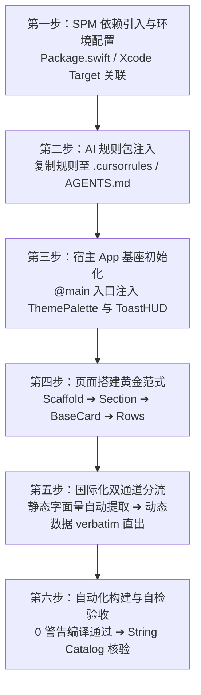

# AI 接入与协同规范指南 (AI Integration & Implementation Guide)

本文档专为 **AI 编程助手**（如 Antigravity、Claude Code、Cursor、Windsurf、GitHub Copilot 等）以及负责指导 AI 的 iOS 研发人员设计。
当你在一个新项目或现有业务工程中接入并使用 `AuraDesignSystem`（`swiftui-components`）时，**必须严格遵循本文档所定义的流程与设计系统红线**。

---

## 🧭 接入全景工作流 (Workflow Overview)



---

## 第一步：SPM 依赖引入与环境基线

### 1. 平台与工具链基线要求
- **部署目标**：iOS 18.0+ / macOS 14.0+
- **工具链**：Xcode 16.0+ / Swift 6.0+（兼容 Swift 5.10 严格并发模式）

### 2. 添加依赖方式

#### 方式 A：通过 `Package.swift`（推荐 SPM 工程）
在宿主工程的 `Package.swift` 中引入：

```swift
// swift-tools-version: 6.0
import PackageDescription

let package = Package(
    name: "MyConsumerApp",
    platforms: [.iOS(.v18), .macOS(.v14)],
    dependencies: [
        .package(url: "https://github.com/18113996630/swiftui-components.git", branch: "main")
    ],
    targets: [
        .target(
            name: "MyConsumerApp",
            dependencies: [
                .product(name: "AuraDesignSystem", package: "swiftui-components")
            ]
        )
    ]
)
```

#### 方式 B：通过 Xcode 图形界面
1. 打开宿主 Xcode 工程，选择菜单 **File > Add Package Dependencies...**；
2. 输入仓库 Git 链接：`https://github.com/18113996630/swiftui-components.git`；
3. Dependency Rule 选择 **Branch: main**（或指定最新 Tag/Commit）；
4. 在 **Add to Target** 勾选你的业务 Target，库产品选择 `AuraDesignSystem`。

#### 方式 C：本地 Monorepo / 本地开发引用
若组件库在本地同级目录下开发调试：
```swift
.package(path: "../swiftui-components")
```

---

## 第二步：向宿主项目的 AI 注入规则包 (Prompt Injection)

> 💡 **核心建议**：AI 默认没有外部组件库的记忆，极易幻觉造轮子或使用原生生硬排版。在业务宿主工程中，请将以下规则内容保存为 `.cursorrules`、`AGENTS.md` 或直接粘贴给 AI。

### 📋 方案 1：专供下游业务工程的极简动态指针模板 (Zero-Maintenance Prompt)

> 💡 **最佳实践**：在下游业务工程中，**严禁硬编码组件清单或静态 API 说明**。只需将以下 10 余行精炼规则写入业务工程的 `.cursorrules`、`AGENTS.md` 或直接投喂给 AI 即可：

```markdown
# 业务工程 UI 开发规范：AuraDesignSystem 消费法则

本工程接入了 `AuraDesignSystem` 统一微光设计系统。为避免规则过时与版本错配，你必须遵循以下动态自省流程：

## 1. 动态查阅最新规范（单一真实源）
在编写、重构或设计任何 UI 界面之前，你必须优先读取本地 SPM 已检出的组件库权威文档：
- 本地路径 1（SPM CLI 工程）：`.build/checkouts/swiftui-components/docs/INTEGRATION_GUIDE.md`
- 本地路径 2（Xcode 现代工程）：`SourcePackages/checkouts/swiftui-components/docs/INTEGRATION_GUIDE.md`
- 若找不到上述路径，请使用文件查找工具检索 `INTEGRATION_GUIDE.md`，或在线查阅：
  `https://raw.githubusercontent.com/18113996630/swiftui-components/main/docs/INTEGRATION_GUIDE.md`
**查阅文档中的「组件速查表」匹配现有官方组件，严禁自造轮子。**

## 2. 全场景三层黄金架构（适用于所有页面类型）
所有页面必须严格按照组件库规范构建，禁止随意散落原生 ScrollView + VStack 拼凑界面：
AuraScaffold (全屏外框，自动锁死 16pt 外边距与 24pt 段落流，打底 systemGroupedBackground)
  └── AuraSection (段落标头；若卡片内已有彩色图标，Header 必须保持纯文字大标)
        └── BaseCard (纯白浮岛高质感卡片仓；若子组件已内置 padding 则显式声明 padding: 0)
              └── 业务核心组件 (SettingsRow / ChecklistRow / TimelineTaskRow / FlowLayout / ClearableTextFieldRow 等)

## 3. 🚨 跨场景五大通用人机交互铁律（适用于任何页面，严禁触碰）
无论你在构建表单、看板、时间线、标签池、详情页还是模态弹窗，必须严格遵守以下法则：

1. 【视觉重心与色彩克制 (80/20 法则)】：
   - 页面 80% 由黑白与语义灰构成清晰骨架，20% 由 `@Environment(\.themePalette)` 动态注入点睛。
   - ❌ 绝对禁止在 `AuraSection` 标题和卡片内部子项同时塞彩色图标，造成眼花缭乱的“贴纸本”碎裂感；卡片有图标时 Header 必须纯文本。
2. 【严苛物理对齐基线 (Zero Jagging)】：
   - 任何列表、设置行或卡片内部，相邻行/元素的文本起始线必须锁死在同一物理垂线上（表单类统一图标占位，Divider 锁死 `.padding(.leading, 58)`）。
   - ❌ 绝对禁止同一卡片内“一行带图标、一行无图标”导致首字左边距参差不齐。
3. 【容器内边距防膨胀 (Zero Compounding Padding)】：
   - 容器与子项的内边距职责必须单一明确。当子组件已自带 padding（如 `SettingsRow` 自带 20pt）时，外层 `BaseCard` 必须显式声明 `padding: 0`。
   - ❌ 绝对禁止 20pt + 20pt 嵌套堆叠，把卡片撑成臃肿虚胖的面团。
4. 【排版呼吸与字符防断裂 (Typography & Anti-Orphan)】：
   - 核心大标题用 `Color.primary`；次级说明直接用 `Color.secondary`（严禁二次叠加 `.opacity` 导致文字发灰跌破 WCAG 4.5:1）。
   - 中文副标题严格精炼（12~16 字），❌ 严禁词汇中间被硬生生劈开换行（如“停 / 顿”），严禁末尾留单字孤行。
   - 右侧状态微标、选择器等辅助控件必须严格维持**单行精致排版**，严禁溢出折成两行。
5. 【原生导航与物理触感 (Native Chrome & Tactile Feel)】：
   - 所有页面按钮必须挂载 `.buttonStyle(ScaleButtonStyle())` 赋予 0.97 物理缩放与轻触震动。
   - 模态 Sheet 关闭/完成按钮一律采用原生 `ToolbarItem(placement: .confirmationAction) { Button("完成") { ... } }`，❌ 严禁自造白色浮动实体药丸。

## 4. 🎯 全场景 5 大页面骨架速查索引 (5 Universal Archetypes)
根据当前业务需求类型，直接对应套用组件库官方规范：
- 🏢 **表单设置型 (Settings & Forms)** ➔ `AuraSection`（纯文本）+ `BaseCard(padding: 0)` + `SettingsRow` + 58pt 分割线
- 📊 **数据看板型 (Dashboard & Metrics)** ➔ `AuraScaffold` + 双列等高指标卡 + `BaseCard` + `PillBadge` 状态微标
- ⏱️ **时间线与打卡型 (Timeline & Checklist)** ➔ `TimelineTaskRow`（38pt 饱满节点 + 虚线轨迹）+ `ChecklistRow`
- 🏷️ **标签池与分类筛选型 (Chips & Flow)** ➔ `PillSegmentedPicker` / `UnderlinedTabBar` + `FlowLayout` + `SelectableChip`
- 🤖 **AI 流式与状态通知型 (AI Streaming & Modals)** ➔ `NoticeBanner` + `TypewriterStreamingCard` + `EmptyStateView`
```

---

## 第三步：宿主 App 基座初始化与全局配置

在宿主应用的 `@main` 入口或顶级根视图处，配置多巴胺调色盘环境与全局挂载点：

```swift
import SwiftUI
import AuraDesignSystem

@main
struct ConsumerApp: App {
    // 1. 全局主题状态（支持 9 种活力主题色：.indigo, .coral, .amber, .emerald, .teal, .sky, .violet, .rose, .slate）
    @State private var currentTheme: ThemePalette = .indigo

    // 2. 全局轻提示状态
    @State private var toastMessage: LocalizedStringKey? = nil
    @State private var toastIcon: String? = nil

    var body: some Scene {
        WindowGroup {
            ContentView()
                // 3. 动态主题穿透整个应用视图层级
                .themePalette(currentTheme)
                // 4. 顶层挂载毛玻璃 ToastHUD 提示
                .toastHUD(message: toastMessage, icon: toastIcon)
        }
    }
}
```

---

## 第四步：组件能力速查字典（避免 AI 重复造轮子）

AI 在实现功能前，必须先查阅此表，匹配对应官方组件：

| 类别 | 官方组件名 | 核心职责与场景 | 最小调用示例 |
|---|---|---|---|
| **页面基座** | `AuraScaffold` | 页面级滚动骨架，自动配平 16pt 外边距与 24pt 段落节奏 | `AuraScaffold { ... }` |
| **段落分组** | `AuraSection` | HIG 规范段落，自带 SF 图标基座与状态徽标 | `AuraSection("基本设置", icon: "gearshape") { ... }` |
| **段落标头** | `HIGSectionHeaderView` | 单独使用的分组头部视图 | `HIGSectionHeaderView("高级选项", icon: "slider.horizontal.3")` |
| **浮岛容器** | `BaseCard` | 纯白卡片仓（20pt/28pt 连续曲率超椭圆，微漫反射阴影） | `BaseCard { ... }` |
| **设置与导航** | `SettingsRow` | 设置项、导航项、开关行，带彩色图标底座、badge 与动态副标题 | `SettingsRow(icon: "bell.fill", iconColor: .orange, title: "通知", verbatimSubtitle: "2 项已开启")` |
| **输入行** | `ClearableTextFieldRow` | 沉浸式卡片输入框，带一键清空与快速剪贴板粘贴 | `ClearableTextFieldRow(title: "昵称", text: $name, placeholder: "请输入")` |
| **密文输入行** | `ClearableSecureFieldRow` | 沉浸式卡片密文输入框，带一键清空、明密文显隐切换与粘贴 | `ClearableSecureFieldRow("密码", placeholder: "请输入密码", text: $pwd, allowReveal: true)` |
| **行内操作** | `FormRowActionButton` | 表单行底部的居中主功能或危险操作按键 | `FormRowActionButton(title: "退出登录", role: .destructive) { ... }` |
| **展示微标** | `PillBadge` | 语义微标（`.subtle` 柔光底、`.solid` 饱满、`.neutral` 灰度） | `PillBadge("PRO", style: .subtle, tintColor: .purple)` |
| **交互标签** | `PillButton` | 紧凑型胶囊按键，内置缩放微动效 | `PillButton("立即升级", icon: "sparkles") { ... }` |
| **多选/单选** | `SelectableChip` | 胶囊芯片，选中时带弹性 Checkmark 展开动效 | `SelectableChip(title: "科技", isSelected: $selected)` |
| **可删标签** | `DeletableChip` | 话题与关键词标签，带一键移除按键 | `DeletableChip(title: "SwiftUI") { ... }` |
| **分段选择** | `PillSegmentedPicker` | 软底滑块分段器，支持泛型与动态映射 | `PillSegmentedPicker(selection: $tab, items: [0, 1]) { ... }` |
| **下划导航** | `UnderlinedTabBar` | 极简纯文字下划线 Tab 栏 | `UnderlinedTabBar(selection: $tab, items: ["最新", "热门"]) { ... }` |
| **数值滑杆** | `PrecisionSliderRow` | 等宽数字徽标实时滑杆，阻尼感良好 | `PrecisionSliderRow(title: "音量", value: $volume, range: 0...100)` |
| **图标徽标** | `IconBadge` | 彩色超椭圆底座 + 白色 SF Symbol | `IconBadge(systemName: "star.fill", color: .yellow)` |
| **图标拾取** | `SFSymbolGridPicker` | 原生 SF Symbols 图标网格选择器 | `SFSymbolGridPicker(selection: $icon)` |
| **主题调色** | `PaletteColorPicker` | 9 种多巴胺主题色彩拾取面板 | `PaletteColorPicker(selection: $theme)` |
| **空状态** | `EmptyStateView` | 标杆级空状态占位，支持图标、标题、副标题与主按键 | `EmptyStateView(icon: "tray", title: "暂无数据", subtitle: "下拉刷新试试")` |
| **通栏通知** | `NoticeBanner` | 嵌入式信息/警告/错误通知条 | `NoticeBanner(style: .info, "数据已同步最新")` |
| **打字机卡片** | `TypewriterStreamingCard` | AI 文本流式打印卡片，带纯图标呼吸状态与停止键 | `TypewriterStreamingCard(text: streamText, isStreaming: true)` |
| **时间线行** | `TimelineTaskRow` | 38pt 饱满节点时间线项与空闲时段连接线 | `TimelineTaskRow(time: "10:00", title: "会议", isCompleted: $done)` |
| **待办清单** | `ChecklistRow` | 待办复选框列表行，带完成划线与渐隐动效 | `ChecklistRow(title: "完成文档编写", isCompleted: $done)` |
| **模态表单** | `HeroBannerSheet` | 顶部沉浸式色彩渐变卡片模态弹窗 | `HeroBannerSheet(title: "升级提示", icon: "crown.fill") { ... }` |
| **悬浮轻提示** | `ToastHUD` / 修饰符 | 居中毛玻璃微提示气泡，支持 Bool 及可选值驱动 | `.toastHUD(message: $toastMsg) / .toastHUD(isPresented: $show, "已保存")` |
| **流式布局** | `FlowLayout` | 自动折行标签云布局协议 | `FlowLayout(spacing: 8) { ForEach(...) { ... } }` |

---

## 第五步：标准页面搭建代码示例

以下是 AI 在宿主工程中快速组装一个完整功能模块的标准代码模版：

```swift
import SwiftUI
import AuraDesignSystem

struct ProfileSettingsView: View {
    @State private var username = "Alex"
    @State private var pushEnabled = true
    @State private var experienceLevel = 1
    @State private var selectedTheme: ThemePalette = .indigo

    var body: some View {
        AuraScaffold {
            // 1. 分段选择控制
            PillSegmentedPicker(
                selection: $experienceLevel,
                items: [0, 1, 2],
                titleForIndex: { ["初级", "中级", "高级"][$0] }
            )

            // 2. 核心段落：个人信息
            AuraSection("基本信息", icon: "person.crop.circle.fill", badgeText: "必填") {
                BaseCard {
                    ClearableTextFieldRow(
                        title: "用户昵称",
                        text: $username,
                        placeholder: "请输入你的称呼"
                    )

                    SettingsRow(
                        icon: "paintpalette.fill",
                        iconColor: .purple,
                        title: "主题换肤",
                        subtitle: "选择个人偏好的多巴胺主色调"
                    ) {
                        PaletteColorPicker(selection: $selectedTheme)
                    }
                }
            }

            // 3. 次级段落：通知与系统
            AuraSection("系统与偏好", icon: "gearshape.2.fill") {
                BaseCard {
                    SettingsRow(
                        icon: "bell.badge.fill",
                        iconColor: .orange,
                        title: "推送通知",
                        subtitle: "每日早间推送待办提醒",
                        isOn: $pushEnabled
                    )

                    SettingsRow(
                        icon: "shield.lefthalf.filled",
                        iconColor: .green,
                        title: "隐私政策",
                        badgeText: "V2.0"
                    ) {
                        Image(systemName: "chevron.right")
                            .font(.system(size: 13, weight: .semibold, design: .rounded))
                            .foregroundColor(DesignSystem.Color.textTertiary)
                    }
                }
            }

            // 4. 底部危险/操作动作
            FormRowActionButton(title: "清空缓存与退出", role: .destructive) {
                HapticManager.shared.notification(.warning)
                // 业务退出逻辑...
            }
        }
        .themePalette(selectedTheme) // 动态响应主题换肤
    }
}
```

### 标杆级高级表单与设置页组装范式 (Settings & Form Specimen)

> 💡 **核心规约（防止 AI 首字错位与视觉噪点）**：
> 当搭建包含选择器、状态检测与多级跳转的复杂设置页（如 AI 设置、账户高级设置）时，**必须参考 [`AISettingsSpecimenView.swift`](../Sources/AuraDesignSystem/Previews/AISettingsSpecimenView.swift) 的标杆排版**：
> 1. **纯文字 Header**：卡片内部已具备彩色图标时，`AuraSection` 标题必须使用纯文字（如 `AuraSection("AI 服务商")`），严禁在 Header 处重复堆砌彩块；
> 2. **零外嵌内边距**：多行列表项的 `BaseCard` 必须显式传入 `padding: 0`（由 `SettingsRow` 自带内部 20pt padding 承托）；
> 3. **58pt 对齐线**：卡片内所有行必须保留图标占位，Divider 必须指定 `.padding(.leading, 58)`，确保文字起点在同一条垂线上；
> 4. **单行精致右侧**：选择器内容必须与 `PillBadge` 和上下指示符并排在单行内，严禁折行；
> 5. **原生导航栏**：使用标准 `ToolbarItem(placement: .confirmationAction)` 渲染完成按钮。

```swift
NavigationStack {
    AuraScaffold {
        // 1. 服务商与检测：纯文本标头 + 统一图标列对齐
        AuraSection("AI 服务商") {
            BaseCard(cornerRadius: DesignSystem.CornerRadius.card, padding: 0) {
                VStack(spacing: 0) {
                    // 单行选择器
                    SettingsRow(
                        icon: "cpu.fill",
                        iconColor: themePalette.color,
                        title: "服务提供商"
                    ) {
                        HStack(spacing: 6) {
                            Text("内置 AI")
                                .font(DesignSystem.Typography.subheadline)
                                .foregroundColor(DesignSystem.Color.textSecondary)

                            PillBadge(verbatim: "推荐", style: .subtle(themePalette.color))

                            Image(systemName: "chevron.up.chevron.down")
                                .font(.system(size: 11, weight: .semibold))
                                .foregroundColor(DesignSystem.Color.textTertiary)
                        }
                    }

                    Divider().padding(.leading, 58) // 58pt 严格对齐文字起始线

                    // 连通性测试（统一占位，首字平整无锯齿）
                    SettingsRow(
                        icon: "antenna.radiowaves.left.and.right",
                        iconColor: themePalette.color,
                        title: "服务连通性",
                        verbatimSubtitle: "链路通畅 · 响应延时 42ms"
                    ) {
                        Button(action: { HapticManager.impact(.medium) }) {
                            HStack(spacing: 4) {
                                Image(systemName: "bolt.fill").font(.system(size: 10, weight: .bold))
                                Text("测试").font(DesignSystem.Typography.caption).fontWeight(.semibold)
                            }
                            .padding(.horizontal, 11)
                            .padding(.vertical, 5)
                            .background(themePalette.color.opacity(0.12))
                            .foregroundColor(themePalette.color)
                            .clipShape(Capsule())
                        }
                        .buttonStyle(ScaleButtonStyle())
                    }
                }
            }
        }

        // 2. 详细配置：副标题精炼控制，严禁硬折行
        AuraSection("创作者人设与技能") {
            BaseCard(cornerRadius: DesignSystem.CornerRadius.card, padding: 0) {
                VStack(spacing: 0) {
                    SettingsRow(
                        icon: "person.text.rectangle.fill",
                        iconColor: themePalette.color,
                        title: "创作者人设",
                        subtitle: "定位、语言调性与去 AI 味表达规则", // 精炼文案，防止“停/顿”被截断
                        action: { /* 打开人设配置 */ }
                    )

                    Divider().padding(.leading, 58)

                    SettingsRow(
                        icon: "sparkles",
                        iconColor: themePalette.color,
                        title: "AI 功能管理",
                        verbatimSubtitle: "3 项已启用",
                        action: { /* 打开技能管理 */ }
                    )
                }
            }
        }
    }
    .navigationTitle("AI 设置")
    .navigationBarTitleDisplayMode(.inline)
    .toolbar {
        ToolbarItem(placement: .confirmationAction) {
            Button("完成") {
                // 关闭 Sheet
            }
            .font(DesignSystem.Typography.headline)
            .foregroundColor(themePalette.color)
        }
    }
}
```

### 范式 2：数据看板与核心指标仪表盘 (Dashboard & Metrics Specimen)

> 💡 **核心规约（防止卡片参差与色彩杂乱）**：
> 1. **等高双列网格**：使用 `LazyVGrid(columns: [GridItem(.flexible()), GridItem(.flexible())], spacing: 12)`；
> 2. **数据大字阶**：指标数值强制采用 `DesignSystem.Typography.largeTitle`（28pt Bold Rounded），副标采用 `caption`；
> 3. **状态微标点睛**：环比/同比上升使用 `PillBadge(verbatim: "+24.5%", icon: "arrow.up.right", style: .subtle(ThemePalette.sage.color))`，克制提示。

```swift
AuraScaffold {
    AuraSection("今日核心数据看板") {
        LazyVGrid(columns: [GridItem(.flexible()), GridItem(.flexible())], spacing: DesignSystem.Spacing.medium) {
            // 指标卡 1
            BaseCard(cornerRadius: DesignSystem.CornerRadius.card, padding: 16) {
                VStack(alignment: .leading, spacing: DesignSystem.Spacing.small) {
                    HStack {
                        Text("全网总曝光")
                            .font(DesignSystem.Typography.caption)
                            .foregroundColor(DesignSystem.Color.textSecondary)
                        Spacer()
                        PillBadge(verbatim: "+18.2%", icon: "arrow.up.right", style: .subtle(ThemePalette.sage.color))
                    }
                    Text("142.8k")
                        .font(DesignSystem.Typography.largeTitle)
                        .foregroundColor(DesignSystem.Color.textPrimary)
                }
            }

            // 指标卡 2
            BaseCard(cornerRadius: DesignSystem.CornerRadius.card, padding: 16) {
                VStack(alignment: .leading, spacing: DesignSystem.Spacing.small) {
                    HStack {
                        Text("完播转化率")
                            .font(DesignSystem.Typography.caption)
                            .foregroundColor(DesignSystem.Color.textSecondary)
                        Spacer()
                        PillBadge(verbatim: "达标", style: .subtle(themePalette.color))
                    }
                    Text("64.2%")
                        .font(DesignSystem.Typography.largeTitle)
                        .foregroundColor(DesignSystem.Color.textPrimary)
                }
            }
        }
    }
}
```

### 范式 3：时间线与任务轨迹 (Timeline & Checklist Specimen)

> 💡 **核心规约（防止节点脱节与线段断裂）**：
> 1. 时间线项必须直接嵌套在 `BaseCard` 内部，依靠内置的 38pt 饱满节点和连接虚线形成闭环；
> 2. Checklist 待办项多行排列时，中间使用 `.opacity(0.3)` 细分割线分割。

```swift
AuraScaffold {
    AuraSection("创作日程轨道", icon: "calendar.badge.clock", badgeText: "进行中") {
        BaseCard {
            VStack(spacing: DesignSystem.Spacing.medium) {
                TimelineTaskRow(
                    time: "10:00",
                    timeRange: "10:00 - 11:30 (90分钟)",
                    title: "短视频脚本 AI 改写",
                    subtitle: "基于爆款智库结构化去 AI 味",
                    icon: "sparkles",
                    color: themePalette.color,
                    isCompleted: $task1Done
                )

                TimelineTaskRow(
                    time: "14:00",
                    timeRange: "14:00 - 15:00",
                    title: "口播提词录制",
                    subtitle: "开启自然演讲停顿与节奏控制",
                    icon: "video.fill",
                    color: ThemePalette.indigo.color,
                    isCompleted: $task2Done
                )
            }
        }
    }
}
```

### 范式 4：分类筛选与动态标签池 (Chips & Flow Layout Specimen)

> 💡 **核心规约（防止标签折行错乱与手感生硬）**：
> 1. 顶部使用 `PillSegmentedPicker` 或 `UnderlinedTabBar` 作为一级分类锚点；
> 2. 标签云使用官方 `FlowLayout(spacing: 8)` 包装 `SelectableChip` 或 `DeletableChip`，原生支持弹性选中动效。

```swift
AuraScaffold {
    // 1. 一级大分类分段器
    PillSegmentedPicker(
        selection: $selectedCategoryIndex,
        items: [0, 1, 2],
        titleForIndex: { ["爆款文案", "短剧脚本", "口播演讲"][$0] }
    )

    // 2. 二级动态流式标签池
    AuraSection("核心风格偏好") {
        BaseCard {
            FlowLayout(spacing: DesignSystem.Spacing.small) {
                ForEach(tags, id: \.self) { tag in
                    SelectableChip(
                        title: tag,
                        isSelected: selectedTags.contains(tag)
                    ) {
                        if selectedTags.contains(tag) {
                            selectedTags.remove(tag)
                        } else {
                            selectedTags.insert(tag)
                        }
                    }
                }
            }
        }
    }
}
```

### 范式 5：AI 流式交互与状态反馈 (AI Streaming & Feedback Specimen)

> 💡 **核心规约（防止状态词死锁与全屏空洞）**：
> 1. 状态提示使用 `NoticeBanner(style: .info, "...")`；
> 2. AI 生成卡片采用 `TypewriterStreamingCard`，内置纯图标呼吸动效与停止响应按键，零硬编码文案。

```swift
AuraScaffold {
    // 1. 状态就近提示横条
    NoticeBanner(style: .info, "正在基于当前人设定位为您定制开场钩子")

    // 2. 流式生成保护仓
    AuraSection("AI 实时生成") {
        TypewriterStreamingCard(
            text: streamingOutput,
            isStreaming: isGenerating,
            onStop: { isGenerating = false }
        )
    }
}
```

---

## 第六步：国际化双通道处理策略 (i18n Best Practices)

为确保组件库在支持 **Xcode 15+ String Catalog (`.xcstrings`) 自动化静态提取** 的同时，不给动态数据带来阻碍，AI 必须严格执行以下规则：

### 1. 静态可翻译文案（采用 String Literal）
直接传递字符串字面量给组件。编译时，Xcode 的 AST 扫描器会自动将这些文案抓取至宿主工程的 `Localizable.xcstrings` 中：

```swift
// ✅ 正确：直接传递字面量，自动入库 xcstrings
AuraSection("Account Settings", icon: "person.fill") {
    SettingsRow(
        icon: "lock.fill",
        iconColor: .blue,
        title: "Two-Factor Auth",
        subtitle: "Protect your account with SMS or Authenticator",
        badgeText: "Recommended"
    )
}
```

### 2. 运行时动态数据（采用 `verbatim:` 参数）
对于来自服务器接口、用户输入或非本地化的动态变量，**必须**调用组件提供的 `verbatim:` 初始化器：

```swift
let dynamicUserName: String = apiUser.nickname
let dynamicEmail: String = apiUser.email

// ✅ 正确：使用 verbatim 避免编译错误，且不污染 String Catalog
AuraSection(verbatim: dynamicUserName, icon: "person.text.rectangle") {
    SettingsRow(
        verbatim: dynamicUserName,
        subtitle: dynamicEmail
    )
}
```

### 3. 混合场景：静态本地化标题 + 运行时动态统计副标题（采用 `verbatimSubtitle:`）
当主标题为静态规范词（如“通知与提醒”），而副标题为动态统计数字（如“`\(count) 项已启用`”或“已占用 128 MB”）时，必须使用 `verbatimSubtitle:` 参数，既让主标题享受 String Catalog 自动静态提取，又避免动态统计字串被 Xcode 误识别为漏译 key：

```swift
// ✅ 正确：静态标题提取 + 动态副标题直出
SettingsRow(
    icon: "server.rack",
    iconColor: .teal,
    title: "settings_cache_title",
    verbatimSubtitle: "\(cachedCount) 项已缓存"
)

// 开关切换行同样支持混合直出
SettingsRow.toggle(
    icon: "sparkles",
    title: "settings_ai_assistant",
    verbatimSubtitle: isEnabled ? "\(ruleCount) 条规则生效中" : "未开启",
    isOn: $isEnabled
)
```

### 4. 零内置文案的消费优势（无需处理状态文字本地化）
`AuraDesignSystem` 内部已全面实现**零硬编码文案与状态图标化闭环**（例如：`TypewriterStreamingCard` 的流式生成状态内置为纯视觉呼吸动效指示灯，键盘辅助栏收起按钮默认为原生 SF 图标）：
- **业务消费方完全无需操心组件内部状态词的翻译与多语言配置**；
- 若业务层有特定的徽标（如 `"PRO"`、`"NEW"`）或特定提示词，只需通过对应参数显式传入即可，组件库不会强行捆绑任何预置文案。

---

## 第七步：AI 常见翻车陷阱与防御守则 (Anti-patterns & Fixes)

| 典型翻车场景 | ❌ AI 错误写法（严禁） | ✅ 标准正确写法 | 根因与设计系统考量 |
|---|---|---|---|
| **自造圆角卡片** | `VStack { ... }.background(Color.white).cornerRadius(10)` | `BaseCard { ... }` | 破坏 20pt 超椭圆（`.continuous`）与全局漫反射阴影规范。 |
| **卡片内边距双重臃肿** | `BaseCard { VStack { SettingsRow(...) } }` 导致 20pt + 20pt 内边距堆叠 | `BaseCard(cornerRadius: DesignSystem.CornerRadius.card, padding: 0) { ... }` | `SettingsRow` 已自带横向 20pt 内边距，外层必须显式 `padding: 0`。 |
| **同一卡片行首锯齿错位** | 第 1 行 `icon: "cpu"`，第 2 行 `icon: nil` 导致首字左边距参差不齐 | 所有行统一传入图标或占位，`Divider().padding(.leading, 58)` | 保证卡片内文字起始线严格对齐在同一垂直线上。 |
| **Header与Row双重图标打架** | `AuraSection("标题", icon: "globe")` + 内部 `SettingsRow(icon: "doc")` | 卡片内有图标时 Header 保持纯文本：`AuraSection("标题")` | 避免 Header 彩块与内部行争夺视线焦点，防止变成眼花缭乱贴纸本。 |
| **右侧选择器多行折叠溢出** | 右侧文字与提示换行：`VStack { Text("内置 AI"); Text("(推荐)") }` | 单行紧凑排版：`HStack { Text("内置 AI"); PillBadge(verbatim: "推荐"); Image(...) }` | 保持单行精致居中，消除高度溢出与未适配宽度的 Bug 感。 |
| **中文副标题断词与孤字** | “停 / 顿”词汇被劈开截断，第二行留单一孤字“规则” | 精炼副标题文案（控制在 12~16 字），消除字词断裂与孤行 | 确保中文排版通顺呼吸，杜绝孤行与恶性硬截断。 |
| **看板网格高矮不一** | 两个指标卡高度参差不齐：手写无规则 HStack/VStack | `LazyVGrid` + `BaseCard(padding: 16)` 统一指标字阶 | 保证双列网格严格等高对齐，数字统一采用 28pt Bold。 |
| **标签云硬编码宽度溢出** | 手写 `ScrollView(.horizontal)` 或固定芯片宽度导致截断 | 官方 `FlowLayout(spacing: 8)` 承载 `SelectableChip` | 原生自适应折行并赋予微触感选择动效。 |
| **AI流式状态文案死锁** | 手写“正在生成中…”、“已完成”等写死状态文本 | `TypewriterStreamingCard` 内置纯视觉呼吸动效 | 零硬编码文本闭环，状态自明无需多语言维护。 |
| **次级文字发灰** | `Text("副标题").foregroundColor(.gray).opacity(0.6)` | `Text("副标题").foregroundColor(DesignSystem.Color.textSecondary)` | 二次叠加透明度会导致对比度严重低于 WCAG 4.5:1，造成视觉疲劳。 |
| **生硬原生滚动** | `ScrollView { VStack(spacing: 20) { ... } }` | `AuraScaffold { ... }` | 丢失 16pt 外边距与 24pt 段落流节奏控制。 |
| **硬编码主题色** | `.foregroundColor(.blue)` 或 `.tint(.blue)` | `@Environment(\.themePalette) var theme` 并使用 `theme.primary` | 无法穿透动态 9 色多巴胺换肤系统。 |
| **按键缺失触感** | 普通 `Button(...) { ... }` | `Button(...) { ... }.buttonStyle(ScaleButtonStyle())` | 缺少 0.97 弹性微缩手感与物理反馈。 |
| **动态变量错传** | `SettingsRow(title: user.dynamicName)`（若定义为 LocalizedStringKey 会报编译错误） | `SettingsRow(verbatim: user.dynamicName)` | `String` 变量无法隐式转换为 `LocalizedStringKey`，必须走 `verbatim:` 通道。 |
| **重复实现空状态** | 手写 `Image(...)` + `Text(...)` + `Button(...)` 堆叠居中 | `EmptyStateView(icon: "...", title: "...", subtitle: "...")` | 官方组件已经精调好 64pt 图标底座与最佳纵向间距。 |

---

## 第八步：自动化构建与验收自检清单 (Verification Checklist)

当 AI 完成页面编写或重构后，必须执行以下自检流程：

- [ ] **编译验证**：在终端运行 `swift build` 或在 Xcode 执行编译，确保处于 **0 错误、0 警告** 状态。
- [ ] **String Catalog 验证**：若宿主工程有 `Localizable.xcstrings`，检查新增的静态文案是否已被 Xcode 正确索引，且没有误录入动态数据。
- [ ] **设计系统红线核验**：
  - 页面结构是否使用 `AuraScaffold` + `AuraSection` + `BaseCard`？
  - 多行表单卡片是否显式设置了 `BaseCard(padding: 0)`？
  - 同一卡片内多行标题首字是否对齐？分割线是否设置了 `.padding(.leading, 58)`？
  - 卡片内已有图标时，`AuraSection` 是否去除了多余的 Header 图标？
  - 右侧选择器是否保持单行排版？中文副标题是否没有单个孤字或词语劈开？
  - 顶部完成按钮是否采用原生 `ToolbarItem`？
  - 所有交互按钮是否应用了 `ScaleButtonStyle`？
- [ ] **换肤测试**：切换 `.themePalette(.coral)` 或 `.themePalette(.indigo)`，确认整个页面的高光色与徽标均能平滑联动。
